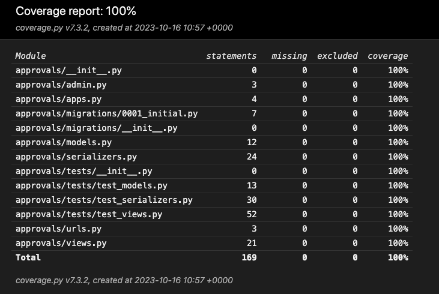
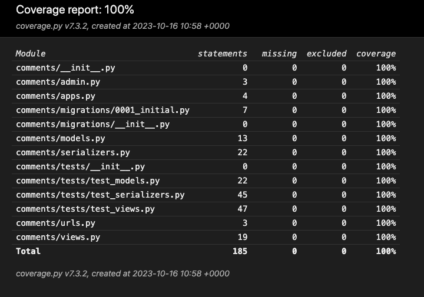
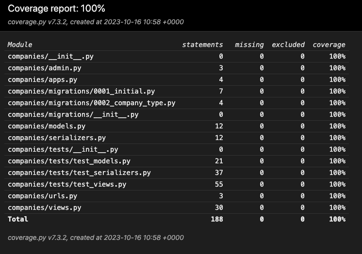
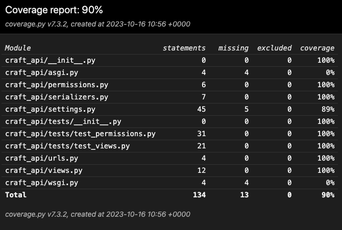
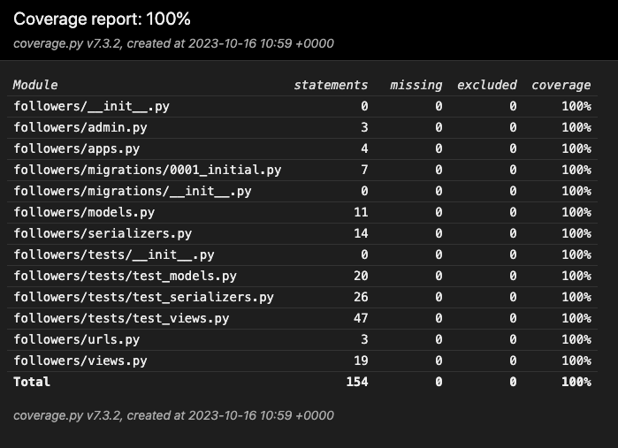
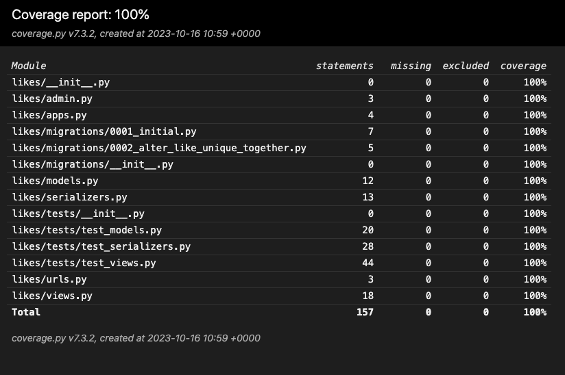
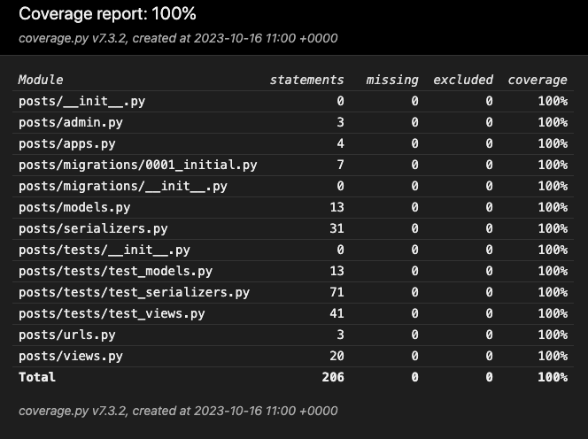
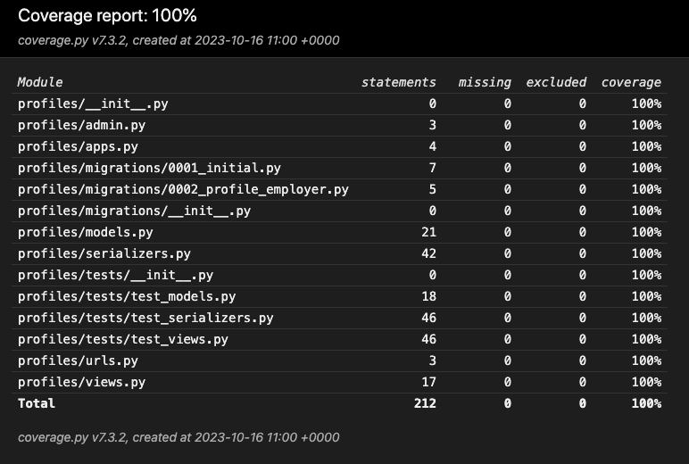

# Craft API

## Contents

- [Testing](#testing)
    - [Automated Testing](#automated-testing)
    - [Coverage](#coverage)
    - [Python Linter](#python-linter)
- [References](#references)

## Testing

### Automated Testing

To test test the overall functionality of the craft_api project and its containing apps, automated testing was implemented with the goal of testing all views, serializers, custom permissions and models which were created during the build. During the testing phase there was **92** tests passed, including **197** assertions. There are many more tests which could possibly be written and cover more situations, however, the goal with the current applicaiton scope was to simple cover as much functionality as possible using `coverage` as a testing tool.

Initially when building the testcases I had to learn the difference bewteen TestCase and APITestCase, however after reading the necessary documents it was clear that APITestCase would be useful for testing api endpoints therefore it was used for testiing views, serializers and permissions. TestCase was useful for testing the models as this doesnt rewuire the same functionality in the tests.

*Some resources I used to build knowledge and write tests: [Testing references](#testing-using-apitestcase-apiclient)*

### Coverage

I used `coverage` throughout the testing phase to measure the percentage of each apps covered code. `Coverage` highlighted which specific lines of code were not tested when running the html server. This enabled me to build more tests to target these lines of code. I seperated each apps tests into seperate files for clarity, each app had the folowing tests file structure:

    - app/
        - tests/
            - __init__.py
            - test_models.py
            - test_serializers.py
            - test_views.py

After using `coverage` I was able to reach **100%** of the code covered within all apps.

The main project file 'craft_api' only reached **90%** coverage. This is due to wsgi.py and asgi.py files which are created by Django as entry points for different application servers and the settings.py file.

To run `coverage` for the entire application, type in command line:

    coverage run manage.py test

To run `coverage` for each app, type in command line:

    coverage run --source=<app_name> manage.py test <app_name>

Coverage Reports Screenshots

#### Python Linter

To check for syntax errors in the project's Python code I used `pycodestyle` *(formerly pep8)*. Using this I was able to test my code from inside the command line. Its a fast and easy way to heck the syntax as it returns the file name and lines of the error.

To install `pycodestyle` in the command line:

    pip install pycodestyle

Then to test the files in the command line:

    pycodestyle <file_name>
    or
    pycodestyle .

When initially running the linter there were a few errors which I addressed and corrected. After these corrections the only errors left were *'E501 line too long'*. These were mostly found in the migration files automatically created during the `makemigration` command. After updating these there were no more errors within my files.

To check I ran the following in the command line:

    pycodestyle <app_name> *(all apps)*
    pycodestyle . (only errors shown in .vscode files)

[⏫ contents](#contents)

## References

### Overal api structure, setup(settings), JWT.

I took guidance from DRF API Walkthrough project on the CodeInstitute Advanced Front-End program. It aided me mostly in the setup phase, and particularly with the JWT setup. After completeing the walkthrough I had created an API which I was able to refer to.

[JWT docs](https://jwt.io/introduction)

[My drf-API version](https://github.com/mtmanning93/drf-API)

-----------------------------------------------

### Testing using APITestCase, APIClient

When testing the craft_api apps I has to learn the difference between TestCase and APITestCase. In the end I used APITestCase of course because it was specifically designed for testing RESTful APIs but it also amde it easier to test the api endpoints. To do the testing I required the help several resources.

[DRF testing docs](https://www.django-rest-framework.org/api-guide/testing/#testing)

[Raising Errors when testing](https://docs.python.org/2/library/unittest.html#unittest.TestCase.assertRaises)

[Testing serializers basic](https://django-testing-docs.readthedocs.io/en/latest/serialization.html#)

[Testing a ValidationError](https://stackoverflow.com/questions/37344038/testing-for-a-validationerror-in-django)

[Assertion docs](https://docs.djangoproject.com/en/3.0/topics/testing/tools/#django.test.SimpleTestCase.assertRaisesMessage)

[Using assertRaises correctly](https://www.pythonclear.com/unittest/python-unittest-assertraises/)

[Using `create_user` over `create` on User objects](https://stackoverflow.com/questions/63054997/difference-between-user-objects-create-user-vs-user-objects-create-vs-user)

-----------------------------------------------

### The use of `to_representation` in profiles and approvals serializers.

[DRF - Overriding serialization and deserialization behavior](https://www.django-rest-framework.org/api-guide/serializers/#overriding-serialization-and-deserialization-behavior)

[Calling `super()` and custom outputs](https://dev.to/abdenasser/my-personal-django-rest-framework-serializer-notes-2i22)

-----------------------------------------------

### DRF settings

[Date and time formatting](https://www.django-rest-framework.org/api-guide/settings/#date-and-time-formatting)

[Time Conversions](https://docs.python.org/3/library/time.html#time.strftime)

-----------------------------------------------

### DRF Generic views & Filtering

[Using DRF generic views](https://python.plainenglish.io/all-about-views-in-django-rest-framework-drf-genericapiview-and-mixins-fe37d7db7582)

[Generic views list and explanation](https://www.django-rest-framework.org/api-guide/generic-views/#listapiview)

[Filtering docs](https://www.django-rest-framework.org/api-guide/filtering/)

[⏫ contents](#contents)