# Craft API

## Intro

A social media backend designed and created with the Craft social media application in mind. The API supports user authentication and authorization, allowing users to register, login and logout. It handles the interactive CRUD operations for various database models such as profiles, posts, companies, likes, followers, comments, and approvals. All data passed through the API is validated, having various permissions and restrictions enforced based upon the users role and relationship.

The Craft API serves the following functions:

- Support user authenticatation and authorization.
- Content management through the use of CRUD operations.
    - Create: Authenticated users can create, profile, post, like, approvals, follower, comment, company instances.
    - Read: All users have the ability to view a list of the model instances.
    - Update: Authenticated users can update objects they own, through the use of permissions.
    - Delete: Authenticated users can delete objects they own, through the use of permissions.
- Ensures valid data is passed through the use of data validation and Error Handling.
- Allows role based access via permissions and restrictions.
- Allow cross model interactions such as, liking a post, approving a profile, following a profile, and leaving a comment on a post.

### Live Site

[Hosted on Heroku](https://craft-api-aeec93e46ff2.herokuapp.com/)

### Repository

[Github Repository](https://github.com/mtmanning93/craft-api)

### Project Stack

    Python, Django Rest Framework, Cloudinary, JSON Web Tokens, ElephantSQL with PostgreSQL, Heroku.

### Get Started

To get started follow these steps to clone the github repository locally, and setup other dependencies: 

[Deployement. *(Github cloning, Cloudinary and ElephantSQL setup, Heroku Deployment)*](#deployment)

## Contents

- [Intro](#intro)
    - [Live Site](#live-site)
    - [Repository](#repository)
    - [Project Stack](#project-stack)
    - [Get Started](#get-started)
- [Planning](#planning)
    - [Database ERD](#database-erd)
        - [Database Models](#database-models)
            - [User](#user)
            - [Profile](#profile)
            - [Company](#company)
            - [Post](#post)
            - [Approval](#approval)
            - [Comment](#comment)
            - [Follower](#follower)
            - [Likes](#likes)
- [Development]()
    Use of issues, milestones and backend label in Craft Kanban
- [Capabilites]()
    Explain the most important logical views and relationship Example: liking a post, approving a profile etc.
- [Technologies]()
    - [DRF]()
    - [Cloudinary]()
    - [JWT]()
    - [ElephantSQL]()
- [Bugs]()
- [Deployment]()
    - [Github Cloning](#github-cloning)
    - [Cloudinary](#cloudinary-deployment)
    - [ElephantSQL](#elephantsql-deployment)
    - [Heroku]()
- [Testing](#testing)
    - [Automated Testing](#automated-testing)
    - [Coverage](#coverage)
    - [Manual Testing](#manual-testing)
    - [Python Linter](#python-linter)
- [Credits](#credits)

## Planning

### Database ERD

To create the database structure I first designed an entity relationship diagram, mapping out all models and relationships. This gave a clear visual representation of the database structure I would need. By planning I was able to refer to the ERD when building the apps and models. Understanding the relationships between them also allowed for better understanding when implementing logic in the views and erializers. Below the diagram image is a further explanaitio of the models.

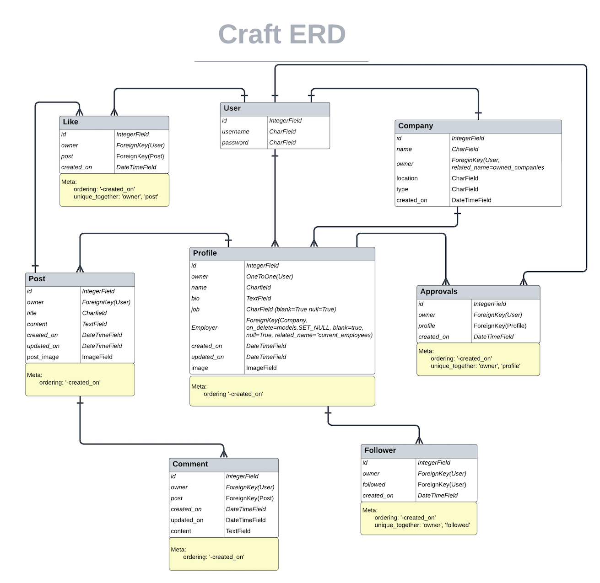

#### Database Models

##### User

##### Profile

##### Company

##### Post

##### Approval

##### Comment

##### Follower

##### Likes

[⏫ contents](#contents)

## Deployment

### Github Cloning
-------------------------

To clone the api from its [GitHub repository](https://github.com/mtmanning93/craft-api), follow the steps below:
a
**1. Navigate to the Reach-reports repository, and click the green 'code' button.**

**2. Once clicked, within the dropdown, copy the clone URL.**

**3. In your local IDE open your Git terminal**

**4. Change your working directory to your preferred location.**

**5. Next type the following command, the 'copied URL' is the URL taken form the Github repo.**

    git clone https://github.com/mtmanning93/craft-api

**6. Hit Enter to create the cloned repository.**

**7. Create an `env.py` file. Here will be where you hold the api's environment variables, in order to run the api successfully you will require the following variables.**

    import os

    os.environ.setdefault("SECRET_KEY", "a secret key of your choice")
    os.environ['DEV'] = "a 'truthy' value"
    os.environ['CLOUDINARY_URL'] = "get from Cloudinary dashboard"
    os.environ['DATABASE_URL'] = "get from SQL provider (ElephantSQL)"

In order to find the above variables you can follow the steps below to set up:
- [Elephant SQL](#elephantsql-deployment)
- [Cloudinary](#cloudinary-deployment)

**8. IMPORTANT! Ensure the env.py file is listed in your .gitignore file to prevent any private information from being public.**

    core.Microsoft*
    core.mongo*
    core.python*
    **env.py**
    __pycache__/
    *.py[cod]
    node_modules/
    .github/
    cloudinary_python.txt

**9. Install all requirements using the following terminal command.**

    pip3 install requirements.txt

**10. Next, to perform database migrations, you can use the following command.**

    python manage.py migrate

**11. Create a new Django superuser. Type the command below and follow the in-terminal prompts to set up.**

    python manage.py createsuperuser

**12. Lastly, run the app using the below command.**

    python manage.py runserver

[⏫ contents](#contents)

### Cloudinary Deployment
-------------------------

Cloudinary was used in the project to store all media files, including defaults. Click the link to navigate to the [Cloudinary website](https://cloudinary.com/). To setup Cloudinary follow the simple steps below:

**1. Navigate to the Cloudinary website and register or login.**

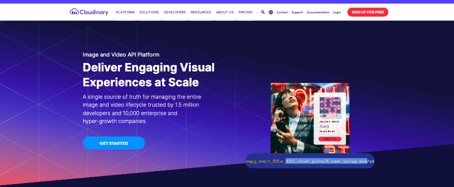

**2. Once the login or registration is complete, navigate to the 'Dashboard' page.**

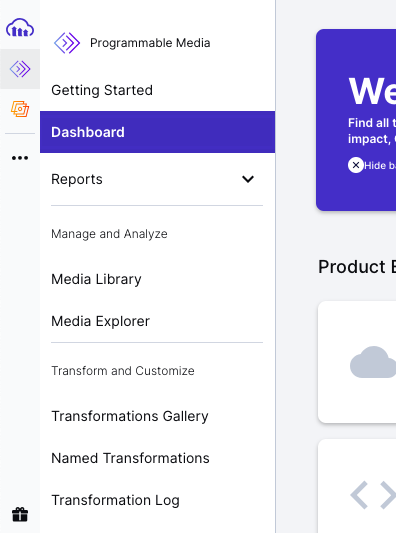

**3. After reaching the dashboard you will find all relevant credentials needed to set up a project with your cloudinary.**

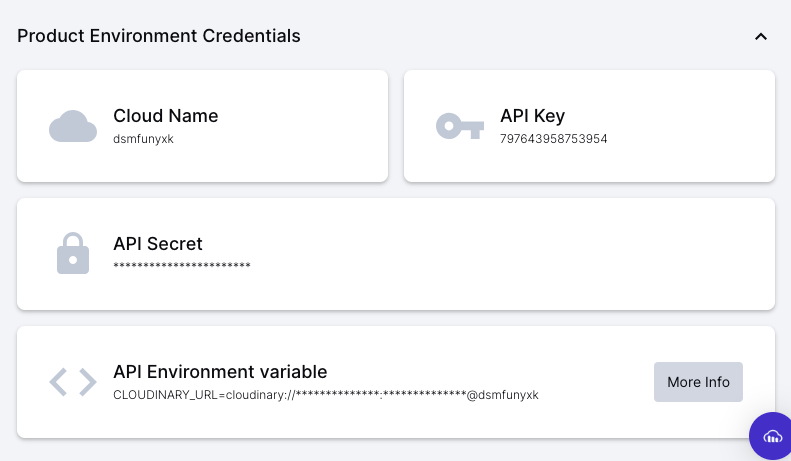

[⏫ contents](#contents)

### ElephantSQL Deployment
-------------------------

The api uses ElephantSQL as the database hosting service with PostgreSQL. Click the link to navigate to the [ElephantSQL site](https://customer.elephantsql.com/). In order to set up ElephantSQL follow these steps:

**1. Create an account or log in to your ElephantSQL dashboard and click the green 'Create New Instance' Button.**

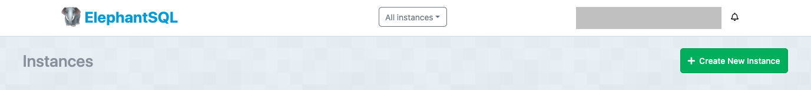

**2. Next setup the instance plan, when the form is complete click 'Select Region'.**

Generally, the title here is the project title. For the api, the 'Tiny Turtle (Free)' plan was selected and the tags field left blank.

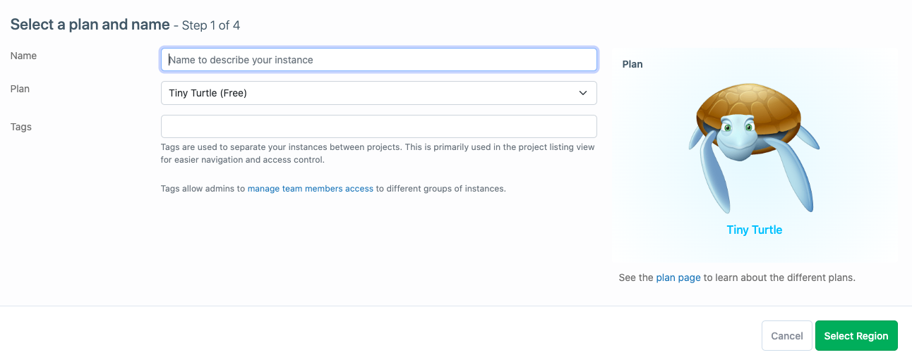

**3. Select the data center closest to you from the dropdown list, when selected click 'Review'.**

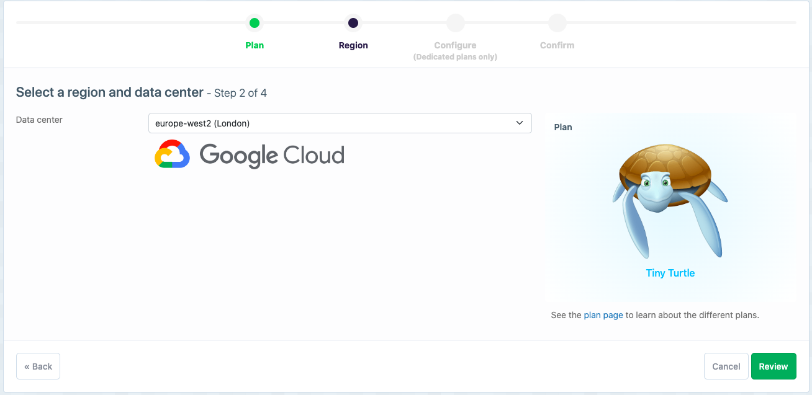

**4. Check the details are correct and click the green 'Create Instance' button.**

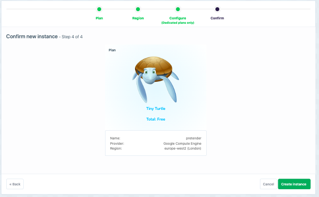

**5. Return to the dashboard and select the new instance just created by clicking on its name.**

**6. This will display all the necessary credentials to connect this project to your database.**

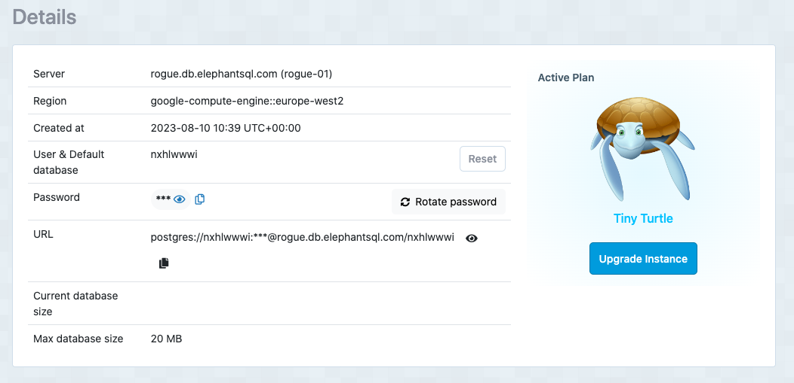

[⏫ contents](#contents)

### Heroku Deployment
-------------------------

The project was deployed using Heroku. Heroku simplifies the deployment process. With a few commands, you can deploy your application without the need to configure servers, networking, or infrastructure. I chose to deploy my project early on to avoid any nasty surprises at the end of the build, this is a great method and reduces stress as the project is already deployed throughout.

In order to deploy my project to Heroku I followed these 10 steps:

**1. Navigate to the Heroku dashboard. Click "New" and select "Create new app".**

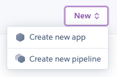

**2. Create an app name and select a region closest to you.**

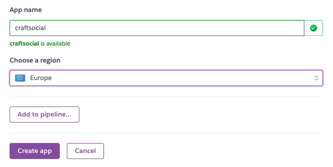

**3. Next, navigate to the 'Settings' tab, and select 'Reveal Config Vars'.**

**4. Add necessary 'Config Vars'.**

For this project, you will need the following 'Config Vars':

- CLOUDINARY_URL: Get from Cloudinary.
- DATABASE_URL: Get from your SQL provider.
- EMAIL_HOST: Get from your email provider.
- GMAIL_ACC: Get from your email provider.
- GMAIL_KEY: Get from your email provider.
- PORT: Set to 8000.
- SECRET_KEY: Django project secret key, generated by your Django project.
- DISABLE_COLLECTSTATIC: Set to 0.

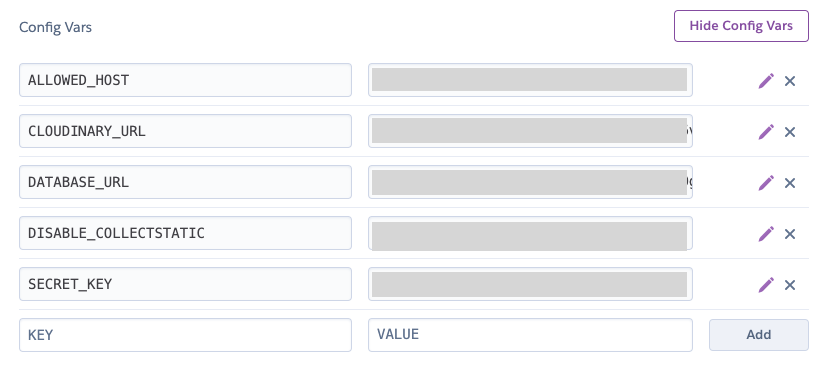

**5. Navigate to the 'Deploy' tab.**

**6. Scroll to the 'Deployment Methods' section and select 'Connect to GitHub'.**

**7. Once connected to GitHub, search for the repository in the 'Connect to GitHub' section, and click 'Connect'.**

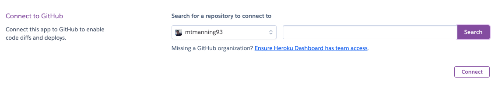

**8. I chose to enable 'Automatic Deploys'. In order to do so click the 'Enable Automatic Deploys' button.**

**9. For manual deployment or to deploy when needed use the 'Manual Deploy' section by clicking 'Deploy Branch'.**

**10. Click 'View' at the bottom of the 'Manual Deploy' section to view the deployed site.**

## Testing

### Automated Testing

To test test the overall functionality of the craft_api project and its containing apps, automated testing was implemented with the goal of testing all views, serializers, custom permissions and models which were created during the build. During the testing phase there was **92** tests passed, including **197** assertions. There are many more tests which could possibly be written and cover more situations, however, the goal with the current applicaiton scope was to simple cover as much functionality as possible using `coverage` as a testing tool.

Initially when building the testcases I had to learn the difference bewteen TestCase and APITestCase, however after reading the necessary documents it was clear that APITestCase would be useful for testing api endpoints therefore it was used for testiing views, serializers and permissions. TestCase was useful for testing the models as this doesnt rewuire the same functionality in the tests.

*Some resources I used to build knowledge and write tests: [Testing references](#testing-using-apitestcase-apiclient)*

[⏫ contents](#contents)

### Coverage

I used `coverage` throughout the testing phase to measure the percentage of each apps covered code. `Coverage` highlighted which specific lines of code were not tested when running the html server. This enabled me to build more tests to target these lines of code. I seperated each apps tests into seperate files for clarity, each app had the folowing tests file structure:

    - app/
        - tests/
            - __init__.py
            - test_models.py
            - test_serializers.py
            - test_views.py

After using `coverage` I was able to reach **100%** of the code covered within all apps.

The main project file 'craft_api' only reached **90%** coverage. This is due to wsgi.py and asgi.py files which are created by Django as entry points for different application servers and the settings.py file.

To run `coverage` for the entire application, type in command line:

    coverage run manage.py test

To run `coverage` for each app, type in command line:

    coverage run --source=<app_name> manage.py test <app_name>

Coverage Reports Screenshots

[⏫ contents](#contents)

### Manual Testing

[⏫ contents](#contents)

### Python Linter

To check for syntax errors in the project's Python code I used `pycodestyle` *(formerly pep8)*. Using this I was able to test my code from inside the command line. Its a fast and easy way to heck the syntax as it returns the file name and lines of the error.

To install `pycodestyle` in the command line:

    pip install pycodestyle

Then to test the files in the command line:

    pycodestyle <file_name>
    or
    pycodestyle .

When initially running the linter there were a few errors which I addressed and corrected. After these corrections the only errors left were *'E501 line too long'*. These were mostly found in the migration files automatically created during the `makemigration` command. After updating these there were no more errors within my files.

To check I ran the following in the command line:

    pycodestyle <app_name> *(all apps)*
    pycodestyle . (only errors shown in .vscode files)

[⏫ contents](#contents)

## Credits

### Tools

These are other applications and services used to enable the development process. Including planning and deployment.

ER Diagram - [Lucid Chart](https://www.lucidchart.com)

### Overal api structure, setup(settings), JWT.

I took guidance from DRF API Walkthrough project on the CodeInstitute Advanced Front-End program. It aided me mostly in the setup phase, and particularly with the JWT setup. After completeing the walkthrough I had created an API which I was able to refer to.

[JWT docs](https://jwt.io/introduction)

[My drf-API version](https://github.com/mtmanning93/drf-API)

-----------------------------------------------

### Testing using APITestCase, APIClient

When testing the craft_api apps I has to learn the difference between TestCase and APITestCase. In the end I used APITestCase of course because it was specifically designed for testing RESTful APIs but it also amde it easier to test the api endpoints. To do the testing I required the help several resources.

[DRF testing docs](https://www.django-rest-framework.org/api-guide/testing/#testing)

[Raising Errors when testing](https://docs.python.org/2/library/unittest.html#unittest.TestCase.assertRaises)

[Testing serializers basic](https://django-testing-docs.readthedocs.io/en/latest/serialization.html#)

[Testing a ValidationError](https://stackoverflow.com/questions/37344038/testing-for-a-validationerror-in-django)

[Assertion docs](https://docs.djangoproject.com/en/3.0/topics/testing/tools/#django.test.SimpleTestCase.assertRaisesMessage)

[Using assertRaises correctly](https://www.pythonclear.com/unittest/python-unittest-assertraises/)

[Using `create_user` over `create` on User objects](https://stackoverflow.com/questions/63054997/difference-between-user-objects-create-user-vs-user-objects-create-vs-user)

-----------------------------------------------

### The use of `to_representation` in profiles and approvals serializers.

[DRF - Overriding serialization and deserialization behavior](https://www.django-rest-framework.org/api-guide/serializers/#overriding-serialization-and-deserialization-behavior)

[Calling `super()` and custom outputs](https://dev.to/abdenasser/my-personal-django-rest-framework-serializer-notes-2i22)

-----------------------------------------------

### DRF settings

[Date and time formatting](https://www.django-rest-framework.org/api-guide/settings/#date-and-time-formatting)

[Time Conversions](https://docs.python.org/3/library/time.html#time.strftime)

-----------------------------------------------

### DRF Generic views & Filtering

[Using DRF generic views](https://python.plainenglish.io/all-about-views-in-django-rest-framework-drf-genericapiview-and-mixins-fe37d7db7582)

[Generic views list and explanation](https://www.django-rest-framework.org/api-guide/generic-views/#listapiview)

[Filtering docs](https://www.django-rest-framework.org/api-guide/filtering/)

[⏫ contents](#contents)