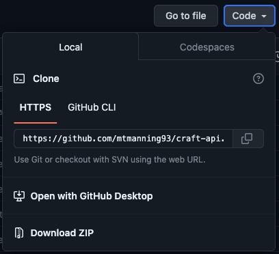
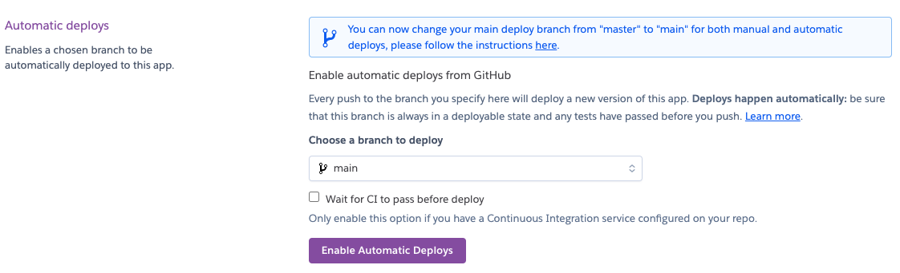
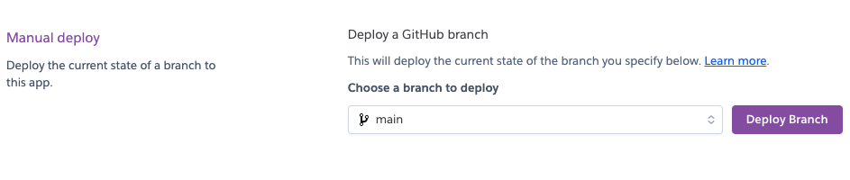

# Craft API

## Intro

A social media backend designed and created with the Craft social media application in mind. The API supports user authentication and authorization, allowing users to register, login and logout. It handles the interactive CRUD operations for various database models such as profiles, posts, companies, likes, followers, comments, and approvals. All data passed through the API is validated, having various permissions and restrictions enforced based upon the users role and relationship.

The Craft API serves the following functions:

- Support user authenticatation and authorization.
- Content management through the use of CRUD operations.
    - Create: Authenticated users can create, profile, post, like, approvals, follower, comment, company instances.
    - Read: All users have the ability to view a list of the model instances.
    - Update: Authenticated users can update objects they own, through the use of permissions.
    - Delete: Authenticated users can delete objects they own, through the use of permissions.
- Ensures valid data is passed through the use of data validation and Error Handling.
- Allows role based access via permissions and restrictions.
- Allow cross model interactions such as, liking a post, approving a profile, following a profile, and leaving a comment on a post.

### Live Site

[Hosted on Heroku](https://craft-api-aeec93e46ff2.herokuapp.com/)

### Repository

[Github Repository](https://github.com/mtmanning93/craft-api)

### Project Stack

    Python, Django Rest Framework, Cloudinary, JSON Web Tokens, ElephantSQL with PostgreSQL, Heroku.

### Get Started

To get started follow these steps to clone the github repository locally, and setup other dependencies: 

[Deployement. *(Github cloning, Cloudinary and ElephantSQL setup, Heroku Deployment)*](#deployment)

## Contents

- [Intro](#intro)
    - [Live Site](#live-site)
    - [Repository](#repository)
    - [Project Stack](#project-stack)
    - [Get Started](#get-started)
- [Planning](#planning)
    - [Database ERD](#database-erd)
    - [Database Models](#database-models)
        - [User](#user)
        - [Profile](#profile)
        - [Company](#company)
        - [Post](#post)
        - [Likes](#likes)
        - [Comment](#comment)
        - [Approval](#approval)
        - [Follower](#follower)
- [API Development](#api-development)
    - [Github Issues](#github-issues)
        - [Templates](#templates)
        - [Backend User Stories](#backend-user-stories)
    - [Backend Iteration](#backend-iteration)
    - [Kanband Board](#kanban-board)
- [API Features](#api-features)
    - [Custom Permissions](#custom-permissions)
    - [Generic Views](#generic-views)
    - [Main API Features](#main-api-features)
        - [Create A Post](#create-a-post)
        - [Approve A Profile](#approve-a-profile)
        - [Like A Post](#like-a-post)
        - [Comment On A Post](#comment-on-a-post)
        - [Follow A Profile](#follow-a-profile)
        - [Create A Company](#create-a-company)
    - [Serializers](#serializers)
        - ['get' Method](#get-method)
        - [validate_image](#validate_image)
        - ['create' Method](#create-method)
        - [to_representation](#to_representation)
    - [Filters](#filters)
        - [Ordering Filter](#ordering-filter)
        - [Search Filter](#search-filter)
        - [Filterset Fields](#filterset-fields)
- [Technologies](#technologies)
    - [Django-Rest-Framework](#django-rest-framework-drf)
    - [Cloudinary](#cloudinary)
    - [ElephantSQL](#elephantsql)
    - [dj-rest-auth](#dj-rest-auth)
    - [JSON Web Tokens](#json-web-tokens-jwt)
- [Fixed Bugs](#fixed-bugs)
- [Deployment](#deployment)
    - [Github Cloning](#github-cloning)
    - [Cloudinary Deployment](#cloudinary-deployment)
    - [ElephantSQL Deployment](#elephantsql-deployment)
    - [Heroku Deployment](#heroku-deployment)
- [Testing](#testing)
    - [Automated Testing](#automated-testing)
    - [Coverage](#coverage)
    - [Manual Testing](#manual-testing)
    - [Python Linter](#python-linter)
- [Credits](#credits)

## Planning

### Database ERD

To create the database structure I first designed an entity relationship diagram, mapping out all models and relationships. This gave a clear visual representation of the database structure I would need. By planning I was able to refer to the ERD when building the apps and models. Understanding the relationships between them also allowed for better understanding when implementing logic in the views and erializers. Below the diagram image is a further explanaitio of the models.

### Database Models

#### User
-------------

Each user instance is created on registration, when the user will provide a username and password. The registration of a user will automatically create a profile instance with the `create_profile` method (*profiles/models.py*). The profile's owner then becomes the user instance created on registration. 

The User model has a OneToOne relationship via the Profile.owner field with the Profile model.

The user is also related via a ForeginKey field with all other models in the database, usually via the model objects owner field.

#### Profile
-------------

A Profile object as discussed above is created when a user registers on the site. Each profile object holds information regarding the user. These fields include:

- **owner:** related via a OneToOne Field with the User model
- **name, bio, job:** these fields are optional additions for a user to enhance their own profile information
- **employer:** related via ForeignKey field with the Company model, its also an optional field where a 
user can add a Company instance as an employer to their profile. The `related_name` attribute is set to 'current_employee' this is for use when searching for employee count inside the Company object.
- **created_on, updated_on:** add a related date and time to the relevant field.
- **image:** the profile image is stored in this field using [Cloudinary](#cloudinary-deployment) for file storage.

#### Company
-------------

A user has the possibility to create a Company object, on creation of a company the user becomes the company owner. Each user can create a maximum of three companies, and a company with the same name and location can not be created, thiys allows for franchises in different locations to be added. These are validated in the `validate_company` method (*companies/views.py*). Other fields include:

- **name:** the company title must be included when creating a company.
- **owner:** related to the company create via a ForeignKey field to the User.
- **location, type:** optional fields where a user can enhance their companies information.
- **created_on:** add a related date and time.

#### Post
-------------

A post oject is the main object a user can create. The Profile model has a OneToMany relationship with the Post model. When a post is created the `owner` field is populated with the User via ForeignKey field. When a post is created a title must be provided as a minimum. If a user chooses to add an image this is also validated first in the `validate_image` method (*posts/serializers.py*) The model fields also include:

- **owner:** populated by the user instance.
- **title:** a minimum requirement for a post instance, maximum length is set to limit the character length.
- **content:** an optional TextField for a user to write a caption related to the posts image or title.
- **created_on, updated_on:** add a related date and time, as a user can update a posts content an updated on field is populated.
- **image:** the optional post image is stored in this field using [Cloudinary](#cloudinary-deployment) for file storage.

#### Like
-------------

The like model is related to the user and post model both via a ForeignKey as a user and post can have many likes associated. A user must select a post to like, in order to post and create a like instance. Of course a post can a have multiple likes associated with its instance however there is a `unique_together` limiter on the likes model. This means a user can only like a particular post once, if this is attempted an error is raised. Field structure of the like model, is as follows:

- **owner:** ForeignKey field related to the User model, automatically populated on creation.
- **post:** ForeignKey field related to the Post model.
- **created_on:** add the date and time a the point of creation.

#### Comment
-------------

Similar to the like model the comment model is related the post and user models via a Forignkey field. A post and user can have many comments therefore the relationship is OneToMany. A comment is always connected to a post instance, therfore its possible to list all comments related to a specific post. Each comment is updatebale by the owner so an `updated_on` field is necessary. Other field explanations:

- **owner:** ForeignKey field related to the User model, automatically populated on creation.
- **post:** ForeignKey field related to the Post model, linking all comments to each post.
- **created_on, updated_on:** add a related date and time, as a user can update a posts content an updated on field is populated.
- **content:** the only required field is a TextField, here is where the users comment is stored.

#### Approval
-------------

The approval model shares a very similar structure to the like model. Its use is best explained as a way to like a profile instead of a post. The approval model will be used to store profile approvals, for instance a user can approve another profile, similar to liking a post. It has ManyToOne relationships with both the profile and user models. A `unique_together` constraint is also added to ensure a user can only approve a profile once. In the profile/serializers.py an `approved_count` field is added, to count the number of approvals associated with each profile. The model is structured as folows:

- **owner:** ForeignKey field related to the User model, automatically populated on creation.
- **profile:** ForeignKey field related to the Profile model, the profile is the 'approved' object.
- **created_on:** add the date and time a the point of creation.

#### Follower
-------------

Lastly is the Follower model. The owner field is populated by the User via a ForeignKey field. This means they are the 'follower'. The followed field is the User instance they are following. Both of these fields have `related_name` attributes, this is so it is possible to update both profiles involved in a follower object creation, and access the data from elsewhere in the database. The follower cannot be updated only deleted so there is no need for an updated_on field. The structure can be seen below:

- **owner:** ForeignKey field related to the User model, automatically populated on creation. The related_name attribute here is 'following'.
- **followed:** this field is related to the User who is being followed. The related_name attribute here is 'followed'. 
- **created_on:** add the date and time a the point of creation.

[⏫ contents](#contents)

## API Development

**All information related to agile development principles is regarding the craft-api(backend) development only. The full agile documentation for the craft project can be found here: [Craft frontend documentation](https://github.com/mtmanning93/craft-front/blob/main/README.md)**

In order to aid in the development process of the API, I needed to use a method to map out some tasks, in order to achieve the complete functionality needed within the API. I used an agile approach. Creating a milestone for all backend components in the API. The issues added to this milestone were all given a backend label as some if not all of the issue tasks were related to the backend fucntionality. With this approach I was able to be productive during the development. If an issues tasks were comepletely finished I was able to close the related issue, however, some issues cover both back and frontend fucntionality. If this was the case the 'backend' label was removed from the issue. When each task was complete manual testing was carried out to ensure correct functionality, before checkng off the task and moving on to the next.

The issues, milestones and kanban board were created inside the [Craft Social repository](https://github.com/mtmanning93/craft-front), the frontend which craft-api was initially created for. Once created the Kanban board (Github Project) was then linked to the craft-api repository.

### Github Issues

#### Templates

To begin the development, I created three templates:

- [User Story](https://github.com/mtmanning93/craft-front/blob/main/.github/ISSUE_TEMPLATE/craft-user-story.md)
- [Bug Report](https://github.com/mtmanning93/craft-front/blob/main/.github/ISSUE_TEMPLATE/craft-bug-report.md)
- [Feature Request](https://github.com/mtmanning93/craft-front/blob/main/.github/ISSUE_TEMPLATE/craft-feature-request-form.md)

#### Backend Label

Once the user stories were created for the [Craft Social poroject](https://github.com/mtmanning93/craft-front) labels were created in order to specify 'MoSCoW' principles and to seperate 'frontend' and 'backend' issues, or to specifiy the issue would cross both. For the API related issues the issues were labelled with the 'backend' label.

To see a full list of labels: [Link to labels](https://github.com/mtmanning93/craft-front/labels)

#### Backend User Stories

As explained before the user stories were created in the [craft-front repo](https://github.com/mtmanning93/craft-front). To aid in the API development a user story related to the backend was assigned the 'backend' label, or if a user story had a task relating to the backend. All user stories related to the backend were added to an iteration (Github Milestone) named ['Craft API Backend Setup'](https://github.com/mtmanning93/craft-front/milestone/2). This made the issues easily distinguishable. Within the iteration they were prioritised using the 'MoSCoW' principle. Finally the Kanban Board was used to visually represent the current tasks throughout the development process.

[Backend Issues list](https://github.com/mtmanning93/craft-front/issues?q=is%3Aopen+is%3Aissue+label%3ABackend)

[Example 'Backend' user story](https://github.com/users/mtmanning93/projects/8?pane=issue&itemId=40699437)

### Backend Iteration

To distinguish all related 'backend' tasks and user stories an iteration was created. In the iteration all user stories labelled with the 'backend' label were added and prioritized. If a user story was completed with all tasks checked and tested, it was closed. Otherwise if the user story contained a backend task which was completed the 'backend' label was removed from the user story, and then the user story removed from the iteration.

['Craft API Backend Setup' iteration](https://github.com/mtmanning93/craft-front/milestone/2?closed=1)

### Kanban Board

A Kanban board was created using Github Projects to visualise the project tasks. The board was seperate into 5 columns:

- Backlog
- Todo
- Bugs
- In Progress
- Done

All User stories are automatically added to the 'Backlog' column. From here they would be moved in to the 'Todo' column when ready to be worked on, and moved to the relevant column from there. Once all tasks in the user story were completed the issue was closed and moved to the 'Done' column.

It was possible to close an issue from the terminal using the `close #10` command from inside a commit message. This would automatically move the issue into the 'Done' column.

[Craft Kanban Board](https://github.com/users/mtmanning93/projects/8)

[⏫ contents](#contents)

## API Features

### Custom Permissions

The only custom permission used is the `IsOwnerOrReadOnly` permission (craft_api/permissions.py), this is used throughout the API to authenticate a user. If a user is the owner they will have complete CRUD functionality over an object, if not they can only read the data provided.

### Generic Views

Rest frameworks generic views were used in develpoment. They are simple to use and enable rapid development for APIs. Other benefits to generic views include a reduction in code volume, built in security features, and extensive documentation for development and testing.
Overall generic views made for an efficient API build, and allowed for heightened security along with specific testing practices. Combined this allowed for a more robust API.

### Main API Features

The main functions of the API are briefly described below. All features are implemented using generic class based views with custom validation methods when necessary.

- ### Create a Post

Registered users have the ability to create a post, a post main data consists of a title, image, and content. When a post is created it is listed in the posts list view. Post objects can be updated by the owner.

- ### Approve a Profile

Authenticated users can approve a profile, this is similar to liking a post but instead liking a profile. The `ApprovalList` view contains a `perform_create` method which validates if the user is approving their own profile. If they are a ValidationError is raised with the message "You cannot approve your own profile". When a profile has been 'approved' it is reflected in the profile instances 'approval_count' field. The `unique_together` constraint ensures a user can not approve the same profile twice, however deleting the approval will decrement the profile instances 'approval_count' field.

- ### Like a Post

Users can like a post instance, this is then reflected in the posts 'likes_count' field. It is a method to show the popularity of a post. The posts can then be ordered by the 'likes_count' field showing the 'most liked' posts. A user can only like a post once thanks to the `unique_together` constraint. Deleting a like instance will decrement the 'likes_count' field from the related post.

- ### Comment on a Post

Another main feature is allowing users to post a comment related to post. The comment must be related to a post instance, via the post field. A comments data includes the owner (commentor), content, created_on. This data creates a conversation like format when combined with the `created_on` ordering. For example you could select all comments related to a post and they will be listed oldest to newest. Authenitcated users have complete CRUD functionality over a comment object they own.

- ### Follow a Profile

Profiles can be followed, this means when a user creates a follower instance it must be related to a profile via the 'followed' field. A follower instance cannot be updated just created and destroyed. When a user follows a profile, the follower instance is created and two other tasks take place:

- the followed profiles 'follower_count' field increments by one
- the creator of the follower instance, will increment their own profiles 'following_count' field by one

Equally when a follower instance is deleted, it is removed from the database and:

- the followed profiles 'follower_count' field decrements by one.
- the creator of the follower instance, will decrement their own profiles 'following_count' field by one

- ### Create A Company

A feature important to the character of the site is the creation of a company. An authenticated user has the ability to create a company instance. On creation they automatically becomes the company owner. A single user can only be the owner of a maximum of three company instances. This is achieved through the `validate_company` method within the CompanyList view. The company must also be unique, it must not share the same name and location credentials as another. It can however have the same name and different location and vice versa, this is to allow for franchised companies to be owned by different users or for multiple companies in the same location.

Another feature related to a company instance is the ability to access the `employee_count` of each company. This is available when a company instance has been selected in a profiles employer field. When selected the `employee_count` field of the company will increment and decrement when removed.

[⏫ contents](#contents)

### Serializers

- ### 'get' Method

In a serializer the `get_<fieldname>` method is used to define the logic which will calculate the value of a specific field in the serialized data of an object. This method was used to inclue additional and context-dependent information in the objects serialized data.

An example of using this method used thorughout the API is:

*(This method ensures the is_owner field is populated with the user if the user is the object owner.)*

    def get_is_owner(self, obj):
        request = self.context['request']
        return request.user == obj.owner

Many fields were manipulated using this method another example is:

*(This method ensures the approved_profile field isnt just a profile id but a profile owners username, making for better readability.)*

    def get_approved_profile(self, obj):
        return obj.profile.owner.username

- ### validate_image

The validate image serializer method is used to ensure an image of incorrect size cannot be added to the database, if it is a `ValidationError` is raised, with a related error message. It is a custom method however it was taken form the Code Institute DRF walkthrough referenced in the [Credits section](#credits). 

*(This method makes sure the image added is under 2mb in size and in the correct dimensions, not too high or wide.)*

    def validate_image(self, value):
        """
        Validates uploaded image size.
        """
        if value.size > 1024 * 1024 * 2:
            raise serializers.ValidationError(
                'Image size larger than 2MB!'
            )
        if value.image.width > 4096:
            raise serializers.ValidationError(
                'Image width larger than 4096px!'
            )
        if value.image.height > 4096:
            raise serializers.ValidationError(
                'Image height larger than 4096px!'
            )
        return value

- ### 'create' Method

The create method is used to define custom logic when an object is created, based on the data in the serialized representation. This was mainly used to trigger a `IntegrityError` or `ValidationError` if the data was not valid. For example:

*(Taken from the LikeSerializer in likes/serializers.py.)*

    def create(self, validated_data):
        try:
            return super().create(validated_data)
        except IntegrityError:
            raise serializers.ValidationError({
                'info': 'possible duplicate'
            })

- ### to_representation

`to_representation` method is used to customize how an object is serialized. In otherwords it allows you to manipulate the format, structure and content of the serialized data in the response. Here is an example:

    def to_representation(self, instance):
        """
        Convert approved profile id field from profile.pk into
        profile.username in a readable string format.
        """
        representation = super().to_representation(instance)
        representation['profile'] = representation.pop('approved_profile')
        return representation

Here is the outcome of the manipulated profile field *(not the profile id but the profile objects owners username)*:

[⏫ contents](#contents)

### Filters

To improve overall usability, and enhance the data filtering overall, `filter_backends` were added to all apps list views. Allowing easier access to specific data. Three main filter methods were used throughout the API including, ordering, search and filterset. Each can be used to narrow down the results listed.
    
- ### Ordering Filter

Its possible to order lists differently depending on the needs of the user simply by adding a `OrderingFilter` to the filter_backends array and specifying ordering methods through the use of lookup strings, defined in the ordering_fields array. This means the list can be ordered by number of comments ascending and descending or number of likes etc.

An example is shown below from the posts/views.py file:

    filter_backends = [
        filters.OrderingFilter,
    ]
    ordering_fields = [
        'comments_count',
        'likes_count',
        'like__created_on',
    ]

- ### Search Filter

A text search filter was implemented to enable searching for an object via a specific text input, this can be found in the list views across all apps in the API.

To implement this you must first add filters.SearchFilter to the filter_backends array. Then specify the fields you wish to be searchable in the search_fields array. Here is an example:

    filter_backends = [
        filters.SearchFilter,
    ]
    search_fields = [
        'owner__username',
        'name',
        'job',
        'employer__name',
        'employer__location',
    ]

- ### Filterset Fields

The django filter feature allows selection from a list of options to filter the querset. It differs from a text search as it gives options from a selected field to choose from, for example, in a list of posts you could filter them by `owner__username`. It is relatively simple to set up and extremely useful. The difficulties can be found in writing the correct 'lookup string method' to traverse models in the database. Its implemented similarly to the search filter but does require a little more setup.

To setup the filter method follow these steps:

#### 1. Install django-filter.

    pip install django-filter

#### 2. Add django_filters to your settings.py installed apps.

    INSTALLED_APPS = [
        ...
        'rest_framework',
        'django_filters',
        'profiles',
        ...
    ]

#### 3. Import DjangoFilterBackend

    from django_filters.rest_framework import DjangoFilterBackend

Here is an example of its implementation:

    filter_backends = [
        DjangoFilterBackend,
    ]
    filterset_fields = [
        'owner__following__followed__profile',
        'owner__followed__owner__profile',
        'employer__current_employee',
    ]

[⏫ contents](#contents)

## Technologies

### Django-Rest-Framework (DRF)

DRF is defined in its documentation as a powerful and flexible toolkit for building Web APIs. Using a Restful API has many advantages in the build, including simplicity, statelessness and security. DRF uses standard HTTP methods like, GET, POST, PUT, DELETE and status codes which are easy to understand and clear to work with. REST (Representational State Transfer) is stateless, this means the connection between server and client is simplified, as all information required to make a request must be sent from the client. Also a DRF api can be secured using standard authentication and authorization methods, such as OAuth and [JWT](#json-web-tokens). Another great advantage to DRF is the documentation, and libraries available to the developer. Making building an api efficient in comparison.

For this build the serialization of the data was extremely useful, it easily allows the conversion of data types, like models into pure JSON or other types if needed. The built in generic views keeps code simple and less verbose, enabling multiple functionalities from one simple line. In the following example it's possible to carry out RUD (Retrieve, Update, Destroy) operations, writing views such as:

    `class PostDetail(generics.RetrieveUpdateDestroyAPIView):`

Finally the documentation provided but such a framework is immensly helpful, allowing for fast solutions to problems along the way. For this particular build the DRF testing docs were used time and time again to clarify testing situations. 

To read more regarding the Django-Rest-Framework and get started, follow this link: [Django-Rest-Framework](https://www.django-rest-framework.org/#installation)

### Cloudinary

Cloudinary is a cloud-based media management platform. As the apis initial purpose is to support the craft social media app, it was clear that media management would be necessary, due to the uploading of images for posts and profile images. Cloudinary is efficient in handling media data and helps to enhance the api's performance. Cloudinary is very simple to setup ([Cloudinary Setup](#cloudinary-deployment)) and has extensive documentation, again making the development process even more efficient. The api alone doesn't need to store many media files in order to function, however it does use some default images for use when a user registers, creating a profile or a post without an image uploaded.

### ElephantSQL

ElephantSQL is a cloud-based database service that manages PostgreSQL databases. It simplifies database management, taking care of time consuming jobs such as, database setup, maintenance. This again allows for an efficient development process. ElephantSWL is fast and easy to setup and integrate into a django project. The site is simple, user friendly and the documentation is again extensive, offering the necessary suppport. To get setup head to the [ElephantSQL Deployment](#elephantsql-deployment) section.

[⏫ contents](#contents)

### dj-rest-auth

Django REST Auth is a third-party package that provides authentication and registration endpoints for a DRF project. It makes the handling of user authentication and registration in Django applications very simple, and it supports the use of JWTs. Together with [JWTs](#json-web-tokens-jwt) it makes the API much more secure using very little additional code.

When including `dj-rest-auth` in the project additional API endpoints were exposed, these are shown below:

    dj-rest-auth/registration/
    dj-rest-auth/login/
    dj-rest-auth/logout/
    dj-rest-auth/user/
    dj-rest-auth/token/refresh/

To include it in the API project, these steps were followed:

#### 1. Install dj-rest-auth.

*(Installs the most supported version, although newer versions are avaliable with the 'pip3 install dj-rest-auth' command)*

    pip3 install dj-rest-auth==2.1.9

#### 2. Add it to the installed apps in settings.py.

    INSTALLED_APPS = [
        ...
        'rest_framework.authtoken',
        'dj_rest_auth',
        ...
    ]

#### 3. Add the dj-rest-auth urls to the main urls file.

    path('dj-rest-auth/', include('dj_rest_auth.urls'))

#### 4. To allow users to register install the following.

    pip install 'dj-rest-auth[with_social]'

#### 5. Update Installed apps.

    INSTALLED_APPS = [
        ...
        'django.contrib.sites',
        'allauth',
        'allauth.account',
        'allauth.socialaccount',
        'dj_rest_auth.registration',
        ...
    ]

#### 6. Declare SITE_ID in settings by adding the following variable.

    SITE_ID = 1

#### 7. Update main urls

    path('dj-rest-auth/registration/', include('dj_rest_auth.registration.urls'))

#### 8. Migrate the database.

    python manage.py migrate

[⏫ contents](#contents)

### JSON Web Tokens (JWT)

JWTs were used in development of the API for security reasons. JWTs enhance an apllications security, they do this by creating a JWT when a user authenticates or logs in. The site can then check the JWT (Payload) to prove the user is who they are, and check to ensure the JWT (Signature) is not fake or been tampered with. Essentially it allows the site to trust the user. A JWT can also expire, which further enhances security. Once the token expires, the client must re-authenticate or login to obtain a new token, reducing the risk of unauthorized access in case a token has been altered.

In summary, JWTs are a great tool for managing authentication and authorization in the API. It is compatible with [dj-rest-auth](#dj-rest-auth) making it the perfect addition to this API. To find out more about JWTs follow this link [JSON Web Tokens](https://jwt.io/).

To install the JWTs, these steps were followed:

#### 1. install JWT.

    pip install djangorestframework-simplejwt

#### 2. update API settings to use 'sessions' or 'tokens' depending on development or production.

    *IMPORTANT: include a dev environemnt variable in your env.py file*

    REST_FRAMEWORK = {
        'DEFAULT_AUTHENTICATION_CLASSES': [(
            'rest_framework.authentication.SessionAuthentication'
            if 'DEV' in os.environ
            else 'dj_rest_auth.jwt_auth.JWTCookieAuthentication'
        )]
    }

#### 3. Update settings to include JWT related settings, as below.

    REST_USE_JWT = True
    JWT_AUTH_SECURE = True
    JWT_AUTH_COOKIE = 'my-app-auth'
    JWT_AUTH_REFRESH_COOKIE = 'my-refresh-token'
    JWT_AUTH_SAMESITE = 'None'

#### 4. Override the default user detail serializer with custom (must be created). 

    REST_AUTH_SERIALIZERS = {
        'USER_DETAILS_SERIALIZER': 'craft_api.serializers.UserSerializer'
    }

#### 5. migrate changes.
    
    python manage.py migrate

For more information on installing and using JWT with dj-rest-auth follow the links in the [dj-rest-auth section](#dj-rest-auth)

[⏫ contents](#contents)

## Fixed Bugs

As with any project development some bugs were discovered and required sqaushing. Although throughout this particular build there were not many here are the explanations and solutions to the bugs.

### Default Images Not Loading

Initially when manual testing for the defualt profile image, I realized the file path within the profile model was incorrect, as the image was broken. On further research it was clear that the file path would require its format extension additionally. It appeared to be a change from Cloudinaries end, which triggered this. A simple additional '.png' fixed the issue and the image was shown.

*The solution is found in profiles.models.py*

    image = models.ImageField(
        upload_to='images/', default='../user_defualt_icon_d7nivg.png'
    )

### Working Out Employee Count

A useful piece of information to the API is how many people have listed a company as their employer form within their profile. To enable this I created a new 'employee_count' field from inside my companies/serializers.py file. However I quickly discovered to return the total number of employees for a company I would need a field name to reference. This meant updating the profile model employer field with a 'related_name' attribute. Now I was able to reverse reference the employer field using the related name, and subsequently access the total number of emplloyees as the employee count.

*The solution is found in profiles.models.py*

    employer = models.ForeignKey(
        Company, on_delete=models.SET_NULL, blank=True, null=True,
        related_name='current_employee'
        )

### Testing Image Validation

When testing the APIs validate_image method found in the posts/serializers.py file different image files would be needed to test the `ValidationError` would be raised. To begin with I attempted to import and use SimpleUploadedFile to mock an image file, however when testing it became clear that this wouldnt return an image file but data, this meant the test would fail. To overcome this I uploaded test images of different sizes which would raise the `ValidationError`. The use of actual image files fixed the problem.

To get images of the incorrect sizes for the validation method I used [img2go](https://www.img2go.com/) to resize a test image to incorrect sizes.

[⏫ contents](#contents)

## Deployment

### Github Cloning

To clone the api from its [GitHub repository](https://github.com/mtmanning93/craft-api), follow the steps below:
a
**1. Navigate to the Reach-reports repository, and click the green 'code' button.**

**2. Once clicked, within the dropdown, copy the clone URL.**

**3. In your local IDE open your Git terminal**

**4. Change your working directory to your preferred location.**

**5. Next type the following command, the 'copied URL' is the URL taken form the Github repo.**

    git clone https://github.com/mtmanning93/craft-api

**6. Hit Enter to create the cloned repository.**

**7. Create an `env.py` file. Here will be where you hold the api's environment variables, in order to run the api successfully you will require the following variables.**

    import os

    os.environ.setdefault("SECRET_KEY", "a secret key of your choice")
    os.environ['DEV'] = "a 'truthy' value"
    os.environ['CLOUDINARY_URL'] = "get from Cloudinary dashboard"
    os.environ['DATABASE_URL'] = "get from SQL provider (ElephantSQL)"

In order to find the above variables you can follow the steps below to set up:
- [Elephant SQL](#elephantsql-deployment)
- [Cloudinary](#cloudinary-deployment)

**8. IMPORTANT! Ensure the env.py file is listed in your .gitignore file to prevent any private information from being public.**

    core.Microsoft*
    core.mongo*
    core.python*
    **env.py**
    __pycache__/
    *.py[cod]
    node_modules/
    .github/
    cloudinary_python.txt

**9. Install all requirements using the following terminal command.**

    pip3 install requirements.txt

**10. Next, to perform database migrations, you can use the following command.**

    python manage.py migrate

**11. Create a new Django superuser. Type the command below and follow the in-terminal prompts to set up.**

    python manage.py createsuperuser

**12. Lastly, run the app using the below command.**

    python manage.py runserver

[⏫ contents](#contents)

### Cloudinary Deployment

Cloudinary was used to store all media files added by users and pre uploaded defaults. Users would add images in the forms of post images and profile images, These will be updated and deleted therefore it is important to store this data. Click the link to navigate to the [Cloudinary website](https://cloudinary.com/). To setup Cloudinary follow the simple steps below:

**1. Navigate to the Cloudinary website and register or login.**

**2. Once the login or registration is complete, navigate to the 'Dashboard' page.**

**3. After reaching the dashboard you will find all relevant credentials needed to set up a project with your cloudinary.**

[⏫ contents](#contents)

### ElephantSQL Deployment

The api uses ElephantSQL as the database hosting service with PostgreSQL. Click the link to navigate to the [ElephantSQL site](https://customer.elephantsql.com/). In order to set up ElephantSQL follow these steps:

**1. Create an account or log in to your ElephantSQL dashboard and click the green 'Create New Instance' Button.**

**2. Next setup the instance plan, when the form is complete click 'Select Region'.**

Generally, the title here is the project title. For the api, the 'Tiny Turtle (Free)' plan was selected and the tags field left blank.

**3. Select the data center closest to you from the dropdown list, when selected click 'Review'.**

**4. Check the details are correct and click the green 'Create Instance' button.**

**5. Return to the dashboard and select the new instance just created by clicking on its name.**

**6. This will display all the necessary credentials to connect this project to your database.**

[⏫ contents](#contents)

### Heroku Deployment

The api was deployed using Heroku. Heroku simplifies the deployment process. With a few commands, you can deploy your application without the need to configure servers, networking, or infrastructure.

In order to deploy the api to Heroku I followed these 10 steps:

**1. Navigate to the Heroku dashboard. Click "New" and select "Create new app".**

**2. Create an app name and select a region closest to you.**

**3. Next, navigate to the 'Settings' tab, and select 'Reveal Config Vars'.**

**4. Add necessary 'Config Vars'.**

For this api, you will need the following 'Config Vars':

- ALLOWED_HOST: Url of website. Url enabled in site `settings.py` file.
- CLOUDINARY_URL: Get from Cloudinary.
- DATABASE_URL: Get from your SQL provider.
- DISABLE_COLLECTSTATIC: Set to 0.
- SECRET_KEY: Django project secret key, chosen by you.

**5. Navigate to the 'Deploy' tab.**

**6. Scroll to the 'Deployment Methods' section and select 'Connect to GitHub'.**

**7. Once connected to GitHub, search for the repository in the 'Connect to GitHub' section, and click 'Connect'.**

**8. I chose to enable 'Automatic Deploys'. In order to do so click the 'Enable Automatic Deploys' button.**

**9. For manual deployment use the 'Manual Deploy' section by clicking 'Deploy Branch'.**

**10. Click 'View' at the bottom of the 'Manual Deploy' section to view the deployed api.**

[⏫ contents](#contents)

## Testing

### Automated Testing

To test test the overall functionality of the craft_api project and its containing apps, automated testing was implemented with the goal of testing all views, serializers, custom permissions and models which were created during the build. During the testing phase there was **92** tests passed, including **197** assertions. There are many more tests which could possibly be written and cover more situations, however, the goal with the current applicaiton scope was to simple cover as much functionality as possible using `coverage` as a testing tool.

Initially when building the testcases I had to learn the difference bewteen TestCase and APITestCase, however after reading the necessary documents it was clear that APITestCase would be useful for testing api endpoints therefore it was used for testiing views, serializers and permissions. TestCase was useful for testing the models as this doesnt rewuire the same functionality in the tests.

*Some resources I used to build knowledge and write tests: [Testing references](#testing-using-apitestcase-apiclient)*

[⏫ contents](#contents)

### Coverage

I used `coverage` throughout the testing phase to measure the percentage of each apps covered code. `Coverage` highlighted which specific lines of code were not tested when running the html server. This enabled me to build more tests to target these lines of code. I seperated each apps tests into seperate files for clarity, each app had the folowing tests file structure:

    - app/
        - tests/
            - __init__.py
            - test_models.py
            - test_serializers.py
            - test_views.py

After using `coverage` I was able to reach **100%** of the code covered within all apps.

The main project file 'craft_api' only reached **90%** coverage. This is due to wsgi.py and asgi.py files which are created by Django as entry points for different application servers and the settings.py file.

To run `coverage` for the entire application, type in command line:

    coverage run manage.py test

To run `coverage` for each app, type in command line:

    coverage run --source=<app_name> manage.py test <app_name>

Coverage Reports Screenshots

[⏫ contents](#contents)

### Manual Testing

[⏫ contents](#contents)

### Python Linter

To check for syntax errors in the project's Python code I used `pycodestyle` *(formerly pep8)*. Using this I was able to test my code from inside the command line. Its a fast and easy way to heck the syntax as it returns the file name and lines of the error.

To install `pycodestyle` in the command line:

    pip install pycodestyle

Then to test the files in the command line:

    pycodestyle <file_name>
    or
    pycodestyle .

When initially running the linter there were a few errors which I addressed and corrected. After these corrections the only errors left were *'E501 line too long'*. These were mostly found in the migration files automatically created during the `makemigration` command. After updating these there were no more errors within my files.

To check I ran the following in the command line:

    pycodestyle <app_name> *(all apps)*
    pycodestyle . (only errors shown in .vscode files)

[⏫ contents](#contents)

## Credits

### Tools

These are othertools used to enable the planning and development process.

ER Diagram - [Lucid Chart](https://www.lucidchart.com)

Image Resizing for Testing - [img2go](https://www.img2go.com/)

-----------------------------------------------

### Overal api structure, setup(settings), JWT.

I took guidance from DRF API Walkthrough project on the CodeInstitute Advanced Front-End program. It aided me mostly in the setup phase, and particularly with the JWT setup. After completeing the walkthrough I had created an API which I was able to refer to.

[JWT docs](https://jwt.io/introduction)

[dj-res-auth docs](https://dj-rest-auth.readthedocs.io/en/latest/installation.html)

[My drf-API version](https://github.com/mtmanning93/drf-API)

-----------------------------------------------

### Testing using APITestCase, APIClient

When testing the craft_api apps I has to learn the difference between TestCase and APITestCase. In the end I used APITestCase of course because it was specifically designed for testing RESTful APIs but it also amde it easier to test the api endpoints. To do the testing I required the help several resources.

[DRF testing docs](https://www.django-rest-framework.org/api-guide/testing/#testing)

[Raising Errors when testing](https://docs.python.org/2/library/unittest.html#unittest.TestCase.assertRaises)

[Testing serializers basic](https://django-testing-docs.readthedocs.io/en/latest/serialization.html#)

[Testing a ValidationError](https://stackoverflow.com/questions/37344038/testing-for-a-validationerror-in-django)

[Assertion docs](https://docs.djangoproject.com/en/3.0/topics/testing/tools/#django.test.SimpleTestCase.assertRaisesMessage)

[Using assertRaises correctly](https://www.pythonclear.com/unittest/python-unittest-assertraises/)

[Using `create_user` over `create` on User objects](https://stackoverflow.com/questions/63054997/difference-between-user-objects-create-user-vs-user-objects-create-vs-user)

-----------------------------------------------

### The use of `to_representation` in profiles and approvals serializers.

[DRF - Overriding serialization and deserialization behavior](https://www.django-rest-framework.org/api-guide/serializers/#overriding-serialization-and-deserialization-behavior)

[Calling `super()` and custom outputs](https://dev.to/abdenasser/my-personal-django-rest-framework-serializer-notes-2i22)

-----------------------------------------------

### DRF settings

[Date and time formatting](https://www.django-rest-framework.org/api-guide/settings/#date-and-time-formatting)

[Time Conversions](https://docs.python.org/3/library/time.html#time.strftime)

-----------------------------------------------

### DRF Generic views & Filtering

[Using DRF generic views](https://python.plainenglish.io/all-about-views-in-django-rest-framework-drf-genericapiview-and-mixins-fe37d7db7582)

[Generic views list and explanation](https://www.django-rest-framework.org/api-guide/generic-views/#listapiview)

[Filtering docs](https://www.django-rest-framework.org/api-guide/filtering/)

[⏫ contents](#contents)