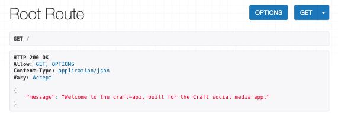
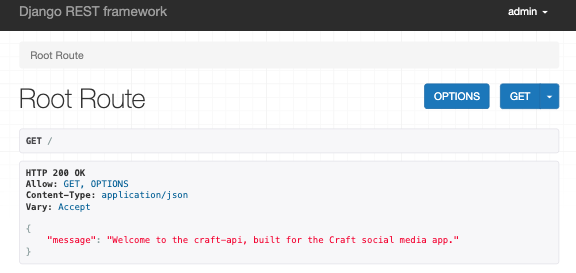
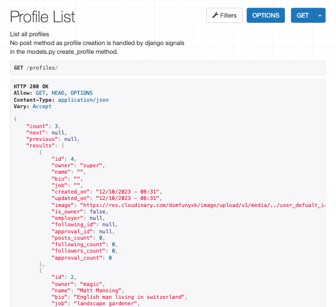
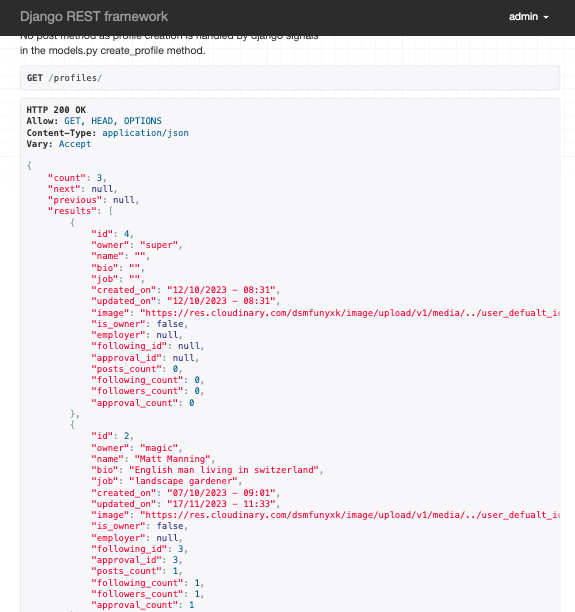
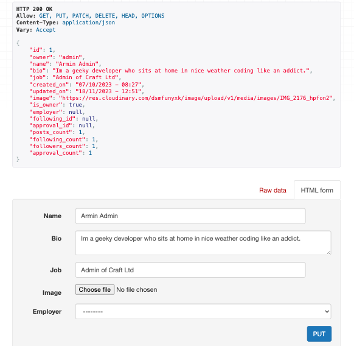
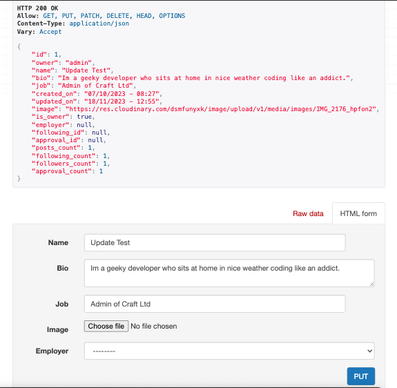

# Manual Testing

- [/](#endpoint-tests)
- [/profiles/](#profiles-tests)
- [/profiles/<int:pk>/](#profiles-tests)

## `/` Tests

| **#** | **Test** | **Test HTTP Method** | **Expected Outcome** | **Expected Status Code** | **Result** | **Action Taken To Pass _(if fail)_** |
| --- | --- | --- | --- | --- | --- | --- |
| 1 | Navigate to the 'root' url as a logged out user | GET | Displays welcome message | 200 | Pass | - |
| 2 | Navigate to the 'root' url as a logged in user | GET | Displays welcome message | 200 | Pass | - |

Test 1 Screenshots

Test 2 Screenshots

## `/profiles/` Tests

| **#** | **Test** | **Test HTTP Method** | **Expected Outcome** | **Expected Status Code** | **Result** | **Action Taken To Pass _(if fail)_** |
| --- | --- | --- | --- | --- | --- | --- |
| 3 | Navigate to the the page url as a logged out user | GET | Returns a lists of all site profiles. | 200 | Pass | - |
| 4 | Navigate to the the page url as a logged in user | GET | Returns a lists of all site profiles. | 200 | Pass | - |

Test 3 Screenshots

Test 4 Screenshots

## `/profiles/<int:pk>/` Tests

| **#** | **Test** | **Test HTTP Method** | **Expected Outcome** | **Expected Status Code** | **Result** | **Action Taken To Pass _(if fail)_** |
| --- | --- | --- | --- | --- | --- | --- |
| 5 | Navigate to a profile details page using `/profiles/1/` url as a logged out user | GET | Displays profile details of the profile with id: 1 | 200 | Pass | - |
| 6 | Navigate to a profile details page using `/profiles/1/` url as a logged in user | GET | Displays profile details of the profile with id: 1 | 200 | Pass | - |
| 7 | Login and navigate to `/profiles/<your profile id>/` update the HTML form name field and click 'PUT' | GET | Profiles JSON name field is updated with the updated name | 200 | Pass | - |

Test 5 Screenshots

Test 6 Screenshots

Test 7 Screenshots

