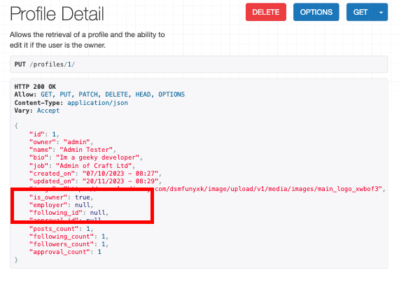
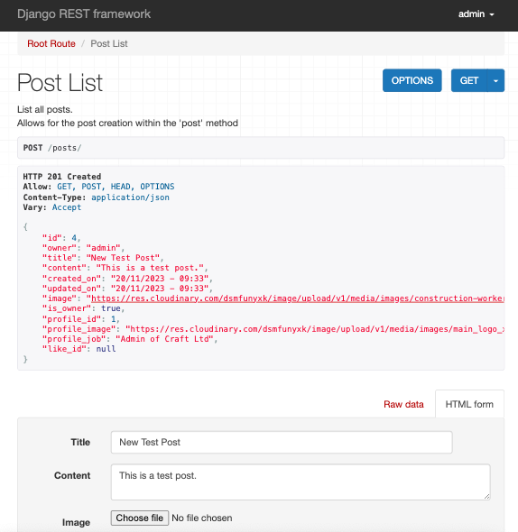
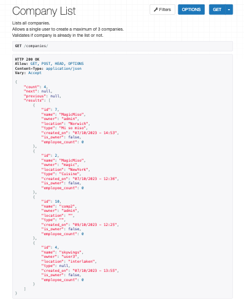
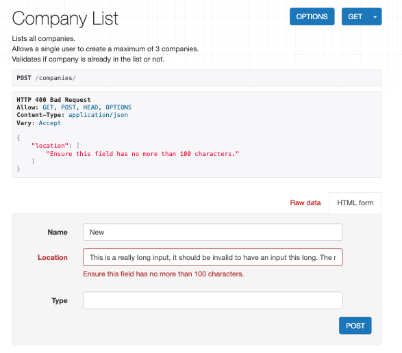

# Manual Testing

- [/](#tests)
- [/profiles/](#profiles-tests)
- [/profiles/<int:pk>](#profilesintpk-tests)
- [/posts/](#posts-tests)
- [/posts/<int:pk>](#postsintpk-tests)
- [/comments/](#comments-tests)
- [/comments/<int:pk>](#commentsintpk-tests)
- [/companies/](#)
- [/companies/<int:pk>](#companiesintpk-tests)

## `/` Tests

| **#** | **Test** | **Test HTTP Method** | **Expected Outcome** | **Expected Status Code** | **Result** | **Action Taken To Pass _(if fail)_** |
| --- | --- | --- | --- | --- | --- | --- |
| 1 | Navigate to the 'root' url as a logged out user | GET | Displays welcome message | 200 | Pass | - |
| 2 | Navigate to the 'root' url as a logged in user | GET | Displays welcome message | 200 | Pass | - |

Test 1 Screenshots

Test 2 Screenshots

## `/profiles/` Tests

| **#** | **Test** | **Test HTTP Method** | **Expected Outcome** | **Expected Status Code** | **Result** | **Action Taken To Pass _(if fail)_** |
| --- | --- | --- | --- | --- | --- | --- |
| 3 | Navigate to the the profiles page url as a logged out user | GET | Returns a lists of all site profiles. | 200 | Pass | - |
| 4 | Navigate to the the profiles page url as a logged in user | GET | Returns a lists of all site profiles. | 200 | Pass | - |  |

Test 3 Screenshots
 

Test 4 Screenshots

## `/profiles/<int:pk>/` Tests

| **#** | **Test** | **Test HTTP Method** | **Expected Outcome** | **Expected Status Code** | **Result** | **Action Taken To Pass _(if fail)_** |
| --- | --- | --- | --- | --- | --- | --- |
| 5 | Navigate to a profile details page using `/profiles/1/` url as a logged out user | GET | Displays profile details of the profile with id: 1 | 200 | Pass | - |
| 6 | Navigate to a profile details page using `/profiles/1/` url as a logged in user | GET | Displays profile details of the profile with id: 1, if owner html update from displays. | 200 | Pass | - |
| 7 | Login and navigate to `/profiles/1/` (owned profile) update the HTML form name field and click 'PUT' | PUT | The profiles JSON name field is updated with the updated name | 200 | Pass | - |
| 8 | Login and navigate to `/profiles/1/` (owned profile) update the HTML form name field with 'Christopher Alexander Harrington III Esquire Jr.' (more than 75 characters) and click 'PUT' | PUT | Validation error is raised with message 'Ensure this field has no more than 75 characters.' | 400 | Pass | - |
| 9 | Login and navigate to `/profiles/1/` (owned profile) update the HTML form bio field and click 'PUT' | PUT | The profiles JSON bio field is updated with the updated information | 200 | Pass | - |
| 10 | Login and navigate to `/profiles/1/` (owned profile) update the HTML form bio field with more than 200 characters and click 'PUT' | PUT | Validation error is raised with message 'Ensure this field has no more than 200 characters.' | 400 | Pass | - |
| 11 | Login and navigate to `/profiles/1/` (owned profile) update the HTML form job field and click 'PUT' | PUT | The profiles JSON job field is updated with the updated information | 200 | Pass | - |
| 12 | Login and navigate to `/profiles/1/` (owned profile) update the HTML form job field with more than 75 characters and click 'PUT' | PUT | Validation error is raised with message 'Ensure this field has no more than 75 characters.' | 400 | Pass | - |
| 13 | Login and navigate to `/profiles/1/` (owned profile) update the image file field with a valid new image and click 'PUT' | PUT | The profiles JSON image field is updated with the updated information | 200 | Pass | - |
| 14 | Login and navigate to `/profiles/1/` (owned profile) update the image file field with a file which is not an image file type and click 'PUT' | PUT | Validation error is raised with message 'Upload a valid image. The file you uploaded was either not an image or a corrupted image.' | 400 | Pass | - |
| 15 | Login and navigate to `/profiles/1/` (owned profile) update the HTML form employer field by selecting an option form the dropdown and click 'PUT' | PUT | The profiles JSON employer field is updated with the updated employer information | 200 | Pass | - |
| 16 | Login and navigate to `/profiles/1/` (owned profile) update the HTML form employer field with the '-----' (none) option and click 'PUT' | PUT | The employer field is reset to null. | 200 | Pass | - |

| Test Screenshots |              |
|-------------|--------------|
| 

Test 5
  
 | 

Test 13
  
 |
| 

Test 6
  
 | 

Test 14
  
 |
| 

Test 7
   
 | 

Test 15
  
 |
| 

Test 8
  
 | 

Test 16
  
 |

## `/posts/` Tests

| **#** | **Test** | **Test HTTP Method** | **Expected Outcome** | **Expected Status Code** | **Result** | **Action Taken To Pass _(if fail)_** |
| --- | --- | --- | --- | --- | --- | --- |
| 17 | Navigate to the /posts/ url as a logged out user | GET | Returns a lists of all site posts, including a count and pagination url links. | 200 | Pass | - |
| 18 | Navigate to the /posts/ url as a logged in user | GET | Returns a lists of all site posts, including a count and pagination url links, plus a logged in user will see a update html form. | 200 | Pass | - |
| 19 | Navigate to the /posts/ url as a logged in user fill out the html form to create a valid post, click 'Post' | POST | Directs user to the new created post details page, new post can be seen in the post list. | 201 | Pass | - |
| 20 | Navigate to the /posts/ url as a logged in user fill out the html form title field with a title longer than 100 characters, click 'Post' | POST | Validation error is raised with message: 'Ensure this field has no more than 100 characters.' | 400 | Pass | - |
| 21 | Navigate to the /posts/ url as a logged in user fill out the html form, add a file which is not an image to the image field, click 'Post' | POST | Validation error is raised with message: "Upload a valid image. The file you uploaded was either not an image or a corrupted image." | 400 | Pass | - |
| 22 | Navigate to the /posts/ url as a logged in user fill out the html form, add an image which is over 2mb in size, click 'Post' | POST | Validation error is raised with message: "Image size larger than 2MB!" | 400 | Pass | - |
| 23 | Navigate to the /posts/ url as a logged in user fill out the html form, add an image which is over 4096px in width, click 'Post' | POST | Validation error is raised with message: "Image width larger than 4096px!" | 400 | Pass | - |
| 24 | Navigate to the /posts/ url as a logged in user fill out the html form, add an image which is over 4096px in height, click 'Post' | POST | Validation error is raised with message: "Image height larger than 4096px!" | 400 | Pass | - |
| 25 | Navigate to the /posts/ url as a logged in user fill out the html form with valid data, do not add an image, click 'Post' | POST | Post instance is created and the image field is populated with the default site. | 400 | Pass | - |

| Test Screenshots |              |
|-------------|--------------|
| 

Test 17
  
 | 

Test 22
  
 |
| 

Test 18
  
 | 

Test 23
  
 |
| 

Test 19
    
 | 

Test 24
  
 |
| 

Test 20
  
 | 

Test 25
 
 |
| 

Test 21
  
 |  |

## `/posts/<int:pk>/` Tests

| **#** | **Test** | **Test HTTP Method** | **Expected Outcome** | **Expected Status Code** | **Result** | **Action Taken To Pass _(if fail)_** |
| --- | --- | --- | --- | --- | --- | --- |
| 26 | Navigate to a post details page url as a logged out user | GET | Returns a lists of all related post details. | 200 | Pass | - |
| 27 | Navigate to the the post page url of a post owned by user | GET | Returns a lists of all post details, including Delete button and html form beneath. | 200 | Pass | - |  |
| 28 | Navigate to the the post page url of a post owned by user | GET | Returns a lists of all post details, including the is_owner field which is set to 'true'. | 200 | Pass | - |
| 29 | Navigate to a post owned by the user, update the title field to a title longer than 100 characters, click 'PUT'. | PUT | Validation error is raised with message: "Ensure this field has no more than 100 characters." | 400 | Pass | - |
| 30 | Navigate to a post owned by the user, update the content field, click 'PUT'. | PUT | Content field updates in the JSON response | 200 | Pass | - |
| 31 | Update the post image file selector, with a file thats not an image. | PUT | Validation error is raised with message: "Upload a valid image. The file you uploaded was either not an image or a corrupted image." | 400 | Pass | - |
| 32 | Update the post image file selector, with an image thats larger than 2mb. | PUT |  Validation error is raised with message: "Image size larger than 2MB!" | 400 | Pass | - |
| 33 | Update the post image file selector, with an image thats wider than 4096px. | PUT | Validation error is raised with message: "Image width larger than 4096px!" | 400 | Pass | - |
| 34 | Update the post image file selector, with an image thats higher than 4096px. | PUT | Validation error is raised with message: "Image height larger than 4096px!" | 400 | Pass | - |
| 35 | Navigate to a post owned by the user, click the delete button. | DELETE | Delete confirmation displays, on confirmation deletes post, post is no longer available in the post list view. | 204 | Pass | - |

| Test Screenshots |              |
|-------------|--------------|
| 

Test 26
  
 | 

Test 31
  
 |
| 

Test 27
  
 | 

Test 32
  
 |
| 

Test 28
  
 | 

Test 33
  
 |
| 

Test 29
  
 | 

Test 34
  
 |
| 

Test 30
  
 | 

Test 35
   
 |

## `/comments/` Tests

| **#** | **Test** | **Test HTTP Method** | **Expected Outcome** | **Expected Status Code** | **Result** | **Action Taken To Pass _(if fail)_** |
| --- | --- | --- | --- | --- | --- | --- |
| 36 | Navigate to the '/comments/' url as a logged out user | GET | Returns a lists of all site comments, including count field and pagination urls. | 200 | Pass | - |
| 37 | Log in and navigate to the '/comments/' url | GET | Returns a lists of all site profiles, including a create comment HTML form. | 200 | Pass | - |  |
| 38 | Log in and navigate to the '/comments/' url, locate the is_owner field. | GET | The logged in user should see the is_owner field populated with 'true' if they own the comment | 200 | Pass | - |  |
| 39 | In the create comment HTML form create a comment by selecting a post from the dropdown and write a message in the content field. | POST | Creates a comment instance, redirects the user to the related comment details page, the comment details match the input details. Comment can also be found in the comments list. | 201 | Pass | - |

| Test Screenshots |              |
|-------------|--------------|
| 

Test 36
  
 | 

Test 38
  
 |
| 

Test 37
  
 | 

Test 39
   
 |

## `/comments/<int:pk>/` Tests

| **#** | **Test** | **Test HTTP Method** | **Expected Outcome** | **Expected Status Code** | **Result** | **Action Taken To Pass _(if fail)_** |
| --- | --- | --- | --- | --- | --- | --- |
| 40 | As a logged out user navigate to '/comments/1/', locate the 'is_owner' field. | GET | The is_owner field is set to false. | 200 | Pass | - |
| 41 | As  logged in user navigate to a comments details page of a comment you own. | GET | The is_owner field is set to true within the JSON response, Delete button is visible, and the update HTML form is visible below. | 200 | Pass | - |
| 42 | Navigate to the HTML form and update the content field, click 'PUT' | PUT | Comment instance is created, the updated comment details are visible in the comment details view. | 200 | Pass | - |
| 43 | Locate the 'created_on' field. | GET | The created on field is displayed in a human 'natural' format. For example, "1 month, 1 week ago" | N/A | Pass | - |
| 44 | Locate the 'updated_on' field. | GET | The updated on field is displayed in a human 'natural' format. For example, "1 month, 1 week ago" | N/A | Pass | - |
| 45 | Update a comment instance, locate the updated on field after valid submission | PUT | The updated on field is displayed as "now". | 200 | Pass | - |
| 46 | Attempt to update the comment form with no input | PUT | Validation error is raised with message: "This field may not be blank." | 400 | Pass | - |
| 47 | Delete a comment instance owned by the user | DELETE | The deletion confirmation is displayed, if confirmed the instance is removed. | 204 | Pass | - |

| Test Screenshots |              |
|-------------|--------------|
| 

Test 40
  
 | 

Test 44
  
  |
| 

Test 41
  
 | 

Test 45
  
 |
| 

Test 42
   
 | 

Test 46
  
 |
| 

Test 43
  
 | 

Test 47
   
 |

## `/companies/` Tests

| **#** | **Test** | **Test HTTP Method** | **Expected Outcome** | **Expected Status Code** | **Result** | **Action Taken To Pass _(if fail)_** |
| --- | --- | --- | --- | --- | --- | --- |
| 48 | Navigate to the '/companies/' url as a logged out user | GET | Returns a list of all company instances from the site, including a count field and the pagination url extensions. | 200 | Pass | - |
| 49 | Navigate to the '/companies/' url as a logged in user | GET | Returns a list of all company instances from the site, including a count field and the pagination url extensions, the create company HTML form is available below. | 200 | Pass | - |
| 50 | Submit the create company form with no data | POST | Validation error is raised. | 400 | Pass | - |
| 51 | Submit the create company form with no data in the 'name' field | POST | Validation error is raised with message: "This field may not be blank.". | 400 | Pass | - |
| 52 | Submit the create company form with only name data | POST | Company instance is created. | 201 | Pass | - |
| 53 | Create a company with duplicate name and location fields as an already created company. | POST | Validation error raised with message: "A company with that title and location already exists." | 400 | Pass | - |
| 54 | Create a company with the name field longer that 100 characters. | POST | Validation error raised name too long. | 400 | Pass | - |
| 55 | Create a company with the location field longer that 100 characters. | POST | Validation error raised location too long. | 400 | Pass | - |
| 56 | Create a company with the type field longer that 100 characters. | POST | Validation error raised type too long. | 400 | Pass | - |
| 57 | Create a new company by filling out the html form with valid data | POST | Company is created, redirecting user to the company details, all relevant details are present, the company can be found in the companies list. | 201 | Pass | - |
| 58 | As a new user attempt to create a 4th company. | POST | Validation error is raised, users can only create a maximum of three companies per profile. The message is "You have reached the max profile limit of 3 companies." | 400 | Pass | - |
| 59 | Create a new company and then navigate to owned profile details, locate the employer dropdown. | GET | The newly created company should be displayed in the employer dropdown list. | 200 | Pass | - |
| 60 | Navigate to a company instance owned by the user and delete. | DELETE | Deletion confirmation modal is displayed, if confirmed the company instance is deleted. | 204 | Pass | - |

| Test Screenshots |                  |                  |
|------------------|------------------|------------------|
| 

Test 48
  
 | 

Test 53
   
 | 

Test 57
   
 |
| 

Test 49
  
 | 

Test 54
  
 | 

Test 58
  
 |
| 

Test 50
  
| 

Test 55
  
 | 

Test 59
  
 |
| 

Test 51
  
 | 

Test 56
  
 | 

Test 60
   
 |
| 

Test 52
  
 |  |  |

## `/companies/<int:pk>/` Tests

| **#** | **Test** | **Test HTTP Method** | **Expected Outcome** | **Expected Status Code** | **Result** | **Action Taken To Pass _(if fail)_** |
| --- | --- | --- | --- | --- | --- | --- |
| 61 | Navigate to a company details page for example '/companies/12/' | GET | Displays the relevant company details, the company id field matches the url input. | 200 | Pass | - |
| 62 | Login and navigate to company details page of a company owned by the user. | GET | Displays the relevant company details, the company id field matches the url input, additionally the is_owner field is set to 'true', Delete button and HTML update form visible. | 200 | Pass | - |
| 63 | Update the company details with the name field longer that 100 characters, click 'PUT'. | PUT | Validation error raised name too long. | 400 | Pass | - |
| 64 | Update the company details with the location field longer that 100 characters, click 'PUT'. | PUT | Validation error raised location too long. | 400 | Pass | - |
| 65 | Update the company details with the type field longer that 100 characters, click 'PUT'. | PUT | Validation error raised type too long. | 400 | Pass | - |
| 66 | Update the company with duplicate name and location fields as an already created company. | POST | Validation error raised with message: "A company with that title and location already exists." | 400 | Fail | Pass - In order to check for duplicate instances on PUT request, the update generic view was overriden with a perform_update method. The logic was copied from the perform_create and validation methods used in the create generic view in `companies/views.py`. With this update the company is correctly validated on PUT request. |
| 67 | Update profiles employer field with the a company instance, then navigate to this companies details url. | PUT/GET | Companies employee_count field has increased by 1 | 200 | Pass | - |
| 68 | Update profiles employer field with the no company instance '--------', then navigate to this companies details url. | PUT/GET | Companies employee_count field has decreased by 1 | 200 | Pass | - |
| 69 | Set profile employer field to company instance, then delete this company instance | DELETE | The profiles employer instance should be automatically set to 'null' after the company is deleted. | 204 | Pass | - |

| Test Screenshots |              |
|-------------|--------------|
| 

Test 61
  
 | 

Test 66
   
 |
| 

Test 62
  
 | 

Test 67
   
 |
| 

Test 63
  
 | 

Test 68
   
 |
| 

Test 64
  
 | 

Test 69
   
 |
| 

Test 65
  
 |  |