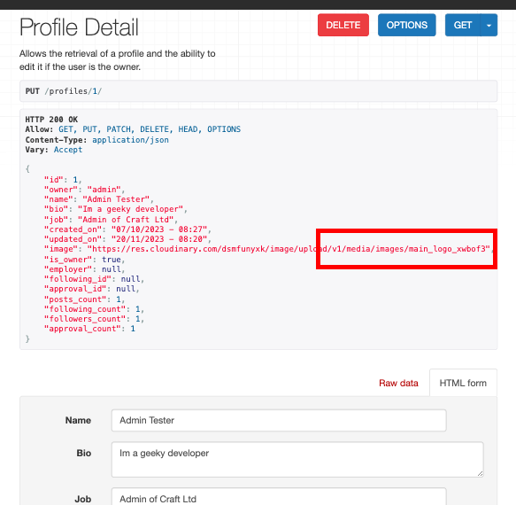
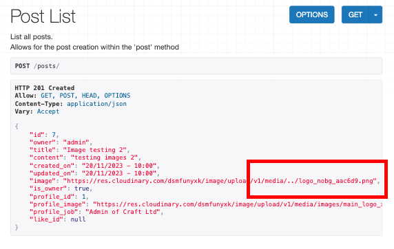
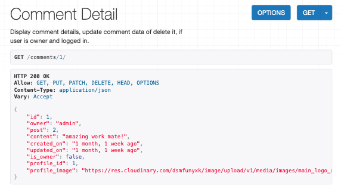
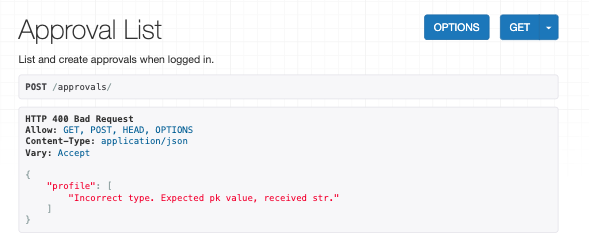
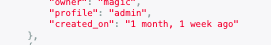
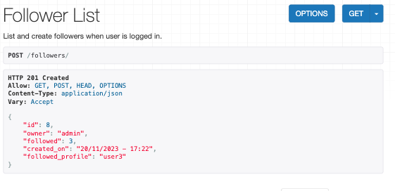

# Testing

## Contents

- [Automated Testing](#automated-testing)
- [Coverage](#coverage)
- [Python Linter](#python-linter)
- [Manual Testing](#manual-testing)
    - [/](#tests)
    - [/profiles/](#profiles-tests)
    - [/profiles/pk/](#profilesintpk-tests)
    - [/posts/](#posts-tests)
    - [/posts/pk/](#postsintpk-tests)
    - [/comments/](#comments-tests)
    - [/comments/pk/](#commentsintpk-tests)
    - [/companies/](#companies-tests)
    - [/companies/pk/](#companiesintpk-tests)
    - [/approvals/](#approvals-tests)
    - [/approvals/pk/](#approvalsintpk-tests)
    - [/likes/](#likes-tests)
    - [/likes/pk/](#likesintpk-tests)
    - [/followers/](#followers-tests)
    - [/followers/pk/](#followersintpk-tests)

[⏪ Main README](README.md)

## Automated Testing

To test test the overall functionality of the craft_api project and its containing apps, automated testing was implemented with the goal of testing all views, serializers, custom permissions and models which were created during the build. During the testing phase there was **92** tests passed, including **197** assertions. There are many more tests which could possibly be written and cover more situations, however, the goal with the current applicaiton scope was to simple cover as much functionality as possible using `coverage` as a testing tool.

Initially when building the testcases I had to learn the difference bewteen TestCase and APITestCase, however after reading the necessary documents it was clear that APITestCase would be useful for testing api endpoints therefore it was used for testiing views, serializers and permissions. TestCase was useful for testing the models as this doesnt rewuire the same functionality in the tests.

The written tests can be found in the `<App>/tests/` files of all apps in the API.

*Some resources I used to build knowledge and write tests can be found in [README.md](README.md) credits section.*

[⏫ contents](#contents)

## Coverage

I used `coverage` throughout the testing phase to measure the percentage of each apps covered code. `Coverage` highlighted which specific lines of code were not tested when running the html server. This enabled me to build more tests to target these lines of code. I seperated each apps tests into seperate files for clarity, each app had the folowing tests file structure:

    - app/
        - tests/
            - __init__.py
            - test_models.py
            - test_serializers.py
            - test_views.py

After using `coverage` I was able to reach **100%** of the code covered within all apps.

The main project file 'craft_api' only reached **90%** coverage. This is due to wsgi.py and asgi.py files which are created by Django as entry points for different application servers and the settings.py file.

To run `coverage` for the entire application, type in command line:

    coverage run manage.py test

To run `coverage` for each app, type in command line:

    coverage run --source=<app_name> manage.py test <app_name>

Coverage Reports Screenshots

 

[⏫ contents](#contents)

## Python Linter

To check for syntax errors in the project's Python code I used `pycodestyle` *(formerly pep8)*. Using this I was able to test my code from inside the command line. Its a fast and easy way to heck the syntax as it returns the file name and lines of the error.

To install `pycodestyle` in the command line:

    pip install pycodestyle

Then to test the files in the command line:

    pycodestyle <file_name>
    or
    pycodestyle .

When initially running the linter there were a few errors which I addressed and corrected. After these corrections the only errors left were *'E501 line too long'*. These were mostly found in the migration files automatically created during the `makemigration` command. After updating these there were no more errors within my files.

To check I ran the following in the command line:

    pycodestyle <app_name> *(all apps)*
    pycodestyle . (only errors shown in .vscode files)

[⏫ contents](#contents)

## Manual Testing

To accompany the automated testing, the Craft-API underwent manual testing on all custom endpoints, covering all CRUD functionality, serialised data, and checking `to_representation` methods. Below are the tests carried out at each API endpoint, they have been seperated by custom endpoint and details the HTTP method used for the test, and expected outcomes. If the test failed the action which was taken to ensure a Pass was made.

All tests include screenshots, in order for larger viewing they are seperate to the tests. To view the screenshot select the test number in the screenshots table below the main tests table for each endpoint.

## `/` Tests

| **#** | **Test** | **Test HTTP Method** | **Expected Outcome** | **Expected Status Code** | **Result** | **Action Taken To Pass _(if fail)_** |
| --- | --- | --- | --- | --- | --- | --- |
| 1 | Navigate to the 'root' url as a logged out user | GET | Displays welcome message | 200 | Pass | - |
| 2 | Navigate to the 'root' url as a logged in user | GET | Displays welcome message | 200 | Pass | - |

| Test Screenshots |
|-------------|
| 

Test 1
  
 |
| 

Test 2
  
 |

[⏫ contents](#contents)

## `/profiles/` Tests

| **#** | **Test** | **Test HTTP Method** | **Expected Outcome** | **Expected Status Code** | **Result** | **Action Taken To Pass _(if fail)_** |
| --- | --- | --- | --- | --- | --- | --- |
| 3 | Navigate to the the profiles page url as a logged out user | GET | Returns a lists of all site profiles. | 200 | Pass | - |
| 4 | Navigate to the the profiles page url as a logged in user | GET | Returns a lists of all site profiles. | 200 | Pass | - |  |

| Test Screenshots |
|-------------|
| 

Test 3
  
 |
| 

Test 4
  
 |

[⏫ contents](#contents)

## `/profiles/<int:pk>/` Tests

| **#** | **Test** | **Test HTTP Method** | **Expected Outcome** | **Expected Status Code** | **Result** | **Action Taken To Pass _(if fail)_** |
| --- | --- | --- | --- | --- | --- | --- |
| 5 | Navigate to a profile details page using `/profiles/1/` url as a logged out user | GET | Displays profile details of the profile with id: 1 | 200 | Pass | - |
| 6 | Navigate to a profile details page using `/profiles/1/` url as a logged in user | GET | Displays profile details of the profile with id: 1, if owner html update from displays. | 200 | Pass | - |
| 7 | Login and navigate to `/profiles/1/` (owned profile) update the HTML form name field and click 'PUT' | PUT | The profiles JSON name field is updated with the updated name | 200 | Pass | - |
| 8 | Login and navigate to `/profiles/1/` (owned profile) update the HTML form name field with 'Christopher Alexander Harrington III Esquire Jr.' (more than 75 characters) and click 'PUT' | PUT | Validation error is raised with message 'Ensure this field has no more than 75 characters.' | 400 | Pass | - |
| 9 | Login and navigate to `/profiles/1/` (owned profile) update the HTML form bio field and click 'PUT' | PUT | The profiles JSON bio field is updated with the updated information | 200 | Pass | - |
| 10 | Login and navigate to `/profiles/1/` (owned profile) update the HTML form bio field with more than 200 characters and click 'PUT' | PUT | Validation error is raised with message 'Ensure this field has no more than 200 characters.' | 400 | Pass | - |
| 11 | Login and navigate to `/profiles/1/` (owned profile) update the HTML form job field and click 'PUT' | PUT | The profiles JSON job field is updated with the updated information | 200 | Pass | - |
| 12 | Login and navigate to `/profiles/1/` (owned profile) update the HTML form job field with more than 75 characters and click 'PUT' | PUT | Validation error is raised with message 'Ensure this field has no more than 75 characters.' | 400 | Pass | - |
| 13 | Login and navigate to `/profiles/1/` (owned profile) update the image file field with a valid new image and click 'PUT' | PUT | The profiles JSON image field is updated with the updated information | 200 | Pass | - |
| 14 | Login and navigate to `/profiles/1/` (owned profile) update the image file field with a file which is not an image file type and click 'PUT' | PUT | Validation error is raised with message 'Upload a valid image. The file you uploaded was either not an image or a corrupted image.' | 400 | Pass | - |
| 15 | Login and navigate to `/profiles/1/` (owned profile) update the HTML form employer field by selecting an option form the dropdown and click 'PUT' | PUT | The profiles JSON employer field is updated with the updated employer information | 200 | Pass | - |
| 16 | Login and navigate to `/profiles/1/` (owned profile) update the HTML form employer field with the '-----' (none) option and click 'PUT' | PUT | The employer field is reset to null. | 200 | Pass | - |

| Test Screenshots |              |
|-------------|--------------|
| 

Test 5
  
 | 

Test 13
  
 |
| 

Test 6
  
 | 

Test 14
  
 |
| 

Test 7
   
 | 

Test 15
  
 |
| 

Test 8
  
 | 

Test 16
  
 |

[⏫ contents](#contents)

## `/posts/` Tests

| **#** | **Test** | **Test HTTP Method** | **Expected Outcome** | **Expected Status Code** | **Result** | **Action Taken To Pass _(if fail)_** |
| --- | --- | --- | --- | --- | --- | --- |
| 17 | Navigate to the /posts/ url as a logged out user | GET | Returns a lists of all site posts, including a count and pagination url links. | 200 | Pass | - |
| 18 | Navigate to the /posts/ url as a logged in user | GET | Returns a lists of all site posts, including a count and pagination url links, plus a logged in user will see a update html form. | 200 | Pass | - |
| 19 | Navigate to the /posts/ url as a logged in user fill out the html form to create a valid post, click 'Post' | POST | Directs user to the new created post details page, new post can be seen in the post list. | 201 | Pass | - |
| 20 | Navigate to the /posts/ url as a logged in user fill out the html form title field with a title longer than 100 characters, click 'Post' | POST | Validation error is raised with message: 'Ensure this field has no more than 100 characters.' | 400 | Pass | - |
| 21 | Navigate to the /posts/ url as a logged in user fill out the html form, add a file which is not an image to the image field, click 'Post' | POST | Validation error is raised with message: "Upload a valid image. The file you uploaded was either not an image or a corrupted image." | 400 | Pass | - |
| 22 | Navigate to the /posts/ url as a logged in user fill out the html form, add an image which is over 2mb in size, click 'Post' | POST | Validation error is raised with message: "Image size larger than 2MB!" | 400 | Pass | - |
| 23 | Navigate to the /posts/ url as a logged in user fill out the html form, add an image which is over 4096px in width, click 'Post' | POST | Validation error is raised with message: "Image width larger than 4096px!" | 400 | Pass | - |
| 24 | Navigate to the /posts/ url as a logged in user fill out the html form, add an image which is over 4096px in height, click 'Post' | POST | Validation error is raised with message: "Image height larger than 4096px!" | 400 | Pass | - |
| 25 | Navigate to the /posts/ url as a logged in user fill out the html form with valid data, do not add an image, click 'Post' | POST | Post instance is created and the image field is populated with the default site. | 400 | Pass | - |

| Test Screenshots |              |
|-------------|--------------|
| 

Test 17
  
 | 

Test 22
  
 |
| 

Test 18
  
 | 

Test 23
  
 |
| 

Test 19
    
 | 

Test 24
  
 |
| 

Test 20
  
 | 

Test 25
 
 |
| 

Test 21
  
 |  |

[⏫ contents](#contents)

## `/posts/<int:pk>/` Tests

| **#** | **Test** | **Test HTTP Method** | **Expected Outcome** | **Expected Status Code** | **Result** | **Action Taken To Pass _(if fail)_** |
| --- | --- | --- | --- | --- | --- | --- |
| 26 | Navigate to a post details page url as a logged out user | GET | Returns a lists of all related post details. | 200 | Pass | - |
| 27 | Navigate to the the post page url of a post owned by user | GET | Returns a lists of all post details, including Delete button and html form beneath. | 200 | Pass | - |  |
| 28 | Navigate to the the post page url of a post owned by user | GET | Returns a lists of all post details, including the is_owner field which is set to 'true'. | 200 | Pass | - |
| 29 | Navigate to a post owned by the user, update the title field to a title longer than 100 characters, click 'PUT'. | PUT | Validation error is raised with message: "Ensure this field has no more than 100 characters." | 400 | Pass | - |
| 30 | Navigate to a post owned by the user, update the content field, click 'PUT'. | PUT | Content field updates in the JSON response | 200 | Pass | - |
| 31 | Update the post image file selector, with a file thats not an image. | PUT | Validation error is raised with message: "Upload a valid image. The file you uploaded was either not an image or a corrupted image." | 400 | Pass | - |
| 32 | Update the post image file selector, with an image thats larger than 2mb. | PUT |  Validation error is raised with message: "Image size larger than 2MB!" | 400 | Pass | - |
| 33 | Update the post image file selector, with an image thats wider than 4096px. | PUT | Validation error is raised with message: "Image width larger than 4096px!" | 400 | Pass | - |
| 34 | Update the post image file selector, with an image thats higher than 4096px. | PUT | Validation error is raised with message: "Image height larger than 4096px!" | 400 | Pass | - |
| 35 | Navigate to a post owned by the user, click the delete button. | DELETE | Delete confirmation displays, on confirmation deletes post, post is no longer available in the post list view. | 204 | Pass | - |

| Test Screenshots |              |
|-------------|--------------|
| 

Test 26
  
 | 

Test 31
  
 |
| 

Test 27
  
 | 

Test 32
  
 |
| 

Test 28
  
 | 

Test 33
  
 |
| 

Test 29
  
 | 

Test 34
  
 |
| 

Test 30
  
 | 

Test 35
   
 |

[⏫ contents](#contents)

## `/comments/` Tests

| **#** | **Test** | **Test HTTP Method** | **Expected Outcome** | **Expected Status Code** | **Result** | **Action Taken To Pass _(if fail)_** |
| --- | --- | --- | --- | --- | --- | --- |
| 36 | Navigate to the '/comments/' url as a logged out user | GET | Returns a lists of all site comments, including count field and pagination urls. | 200 | Pass | - |
| 37 | Log in and navigate to the '/comments/' url | GET | Returns a lists of all site profiles, including a create comment HTML form. | 200 | Pass | - |  |
| 38 | Log in and navigate to the '/comments/' url, locate the is_owner field. | GET | The logged in user should see the is_owner field populated with 'true' if they own the comment | 200 | Pass | - |  |
| 39 | In the create comment HTML form create a comment by selecting a post from the dropdown and write a message in the content field. | POST | Creates a comment instance, redirects the user to the related comment details page, the comment details match the input details. Comment can also be found in the comments list. | 201 | Pass | - |

| Test Screenshots |              |
|-------------|--------------|
| 

Test 36
  
 | 

Test 38
  
 |
| 

Test 37
  
 | 

Test 39
   
 |

[⏫ contents](#contents)

## `/comments/<int:pk>/` Tests

| **#** | **Test** | **Test HTTP Method** | **Expected Outcome** | **Expected Status Code** | **Result** | **Action Taken To Pass _(if fail)_** |
| --- | --- | --- | --- | --- | --- | --- |
| 40 | As a logged out user navigate to '/comments/1/', locate the 'is_owner' field. | GET | The is_owner field is set to false. | 200 | Pass | - |
| 41 | As  logged in user navigate to a comments details page of a comment you own. | GET | The is_owner field is set to true within the JSON response, Delete button is visible, and the update HTML form is visible below. | 200 | Pass | - |
| 42 | Navigate to the HTML form and update the content field, click 'PUT' | PUT | Comment instance is created, the updated comment details are visible in the comment details view. | 200 | Pass | - |
| 43 | Locate the 'created_on' field. | GET | The created on field is displayed in a human 'natural' format. For example, "1 month, 1 week ago" | N/A | Pass | - |
| 44 | Locate the 'updated_on' field. | GET | The updated on field is displayed in a human 'natural' format. For example, "1 month, 1 week ago" | N/A | Pass | - |
| 45 | Update a comment instance, locate the updated on field after valid submission | PUT | The updated on field is displayed as "now". | 200 | Pass | - |
| 46 | Attempt to update the comment form with no input | PUT | Validation error is raised with message: "This field may not be blank." | 400 | Pass | - |
| 47 | Delete a comment instance owned by the user | DELETE | The deletion confirmation is displayed, if confirmed the instance is removed. | 204 | Pass | - |

| Test Screenshots |              |
|-------------|--------------|
| 

Test 40
  
 | 

Test 44
  
  |
| 

Test 41
  
 | 

Test 45
  
 |
| 

Test 42
   
 | 

Test 46
  
 |
| 

Test 43
  
 | 

Test 47
   
 |

[⏫ contents](#contents)

## `/companies/` Tests

| **#** | **Test** | **Test HTTP Method** | **Expected Outcome** | **Expected Status Code** | **Result** | **Action Taken To Pass _(if fail)_** |
| --- | --- | --- | --- | --- | --- | --- |
| 48 | Navigate to the '/companies/' url as a logged out user | GET | Returns a list of all company instances from the site, including a count field and the pagination url extensions. | 200 | Pass | - |
| 49 | Navigate to the '/companies/' url as a logged in user | GET | Returns a list of all company instances from the site, including a count field and the pagination url extensions, the create company HTML form is available below. | 200 | Pass | - |
| 50 | Submit the create company form with no data | POST | Validation error is raised. | 400 | Pass | - |
| 51 | Submit the create company form with no data in the 'name' field | POST | Validation error is raised with message: "This field may not be blank.". | 400 | Pass | - |
| 52 | Submit the create company form with only name data | POST | Company instance is created. | 201 | Pass | - |
| 53 | Create a company with duplicate name and location fields as an already created company. | POST | Validation error raised with message: "A company with that title and location already exists." | 400 | Pass | - |
| 54 | Create a company with the name field longer that 100 characters. | POST | Validation error raised name too long. | 400 | Pass | - |
| 55 | Create a company with the location field longer that 100 characters. | POST | Validation error raised location too long. | 400 | Pass | - |
| 56 | Create a company with the type field longer that 100 characters. | POST | Validation error raised type too long. | 400 | Pass | - |
| 57 | Create a new company by filling out the html form with valid data | POST | Company is created, redirecting user to the company details, all relevant details are present, the company can be found in the companies list. | 201 | Pass | - |
| 58 | As a new user attempt to create a 4th company. | POST | Validation error is raised, users can only create a maximum of three companies per profile. The message is "You have reached the max profile limit of 3 companies." | 400 | Pass | - |
| 59 | Create a new company and then navigate to owned profile details, locate the employer dropdown. | GET | The newly created company should be displayed in the employer dropdown list. | 200 | Pass | - |
| 60 | Navigate to a company instance owned by the user and delete. | DELETE | Deletion confirmation modal is displayed, if confirmed the company instance is deleted. | 204 | Pass | - |

| Test Screenshots |                  |                  |
|------------------|------------------|------------------|
| 

Test 48
  
 | 

Test 53
   
 | 

Test 57
   
 |
| 

Test 49
  
 | 

Test 54
  
 | 

Test 58
  
 |
| 

Test 50
  
| 

Test 55
  
 | 

Test 59
  
 |
| 

Test 51
  
 | 

Test 56
  
 | 

Test 60
   
 |
| 

Test 52
  
 |  |  |

[⏫ contents](#contents)

## `/companies/<int:pk>/` Tests

| **#** | **Test** | **Test HTTP Method** | **Expected Outcome** | **Expected Status Code** | **Result** | **Action Taken To Pass _(if fail)_** |
| --- | --- | --- | --- | --- | --- | --- |
| 61 | Navigate to a company details page for example '/companies/12/' | GET | Displays the relevant company details, the company id field matches the url input. | 200 | Pass | - |
| 62 | Login and navigate to company details page of a company owned by the user. | GET | Displays the relevant company details, the company id field matches the url input, additionally the is_owner field is set to 'true', Delete button and HTML update form visible. | 200 | Pass | - |
| 63 | Update the company details with the name field longer that 100 characters, click 'PUT'. | PUT | Validation error raised name too long. | 400 | Pass | - |
| 64 | Update the company details with the location field longer that 100 characters, click 'PUT'. | PUT | Validation error raised location too long. | 400 | Pass | - |
| 65 | Update the company details with the type field longer that 100 characters, click 'PUT'. | PUT | Validation error raised type too long. | 400 | Pass | - |
| 66 | Update the company with duplicate name and location fields as an already created company. | POST | Validation error raised with message: "A company with that title and location already exists." | 400 | Fail | Pass - In order to check for duplicate instances on PUT request, the update generic view was overriden with a perform_update method. The logic was copied from the perform_create and validation methods used in the create generic view in `companies/views.py`. With this update the company is correctly validated on PUT request. |
| 67 | Update profiles employer field with the a company instance, then navigate to this companies details url. | PUT/GET | Companies employee_count field has increased by 1 | 200 | Pass | - |
| 68 | Update profiles employer field with the no company instance '--------', then navigate to this companies details url. | PUT/GET | Companies employee_count field has decreased by 1 | 200 | Pass | - |
| 69 | Set profile employer field to company instance, then delete this company instance | DELETE | The profiles employer instance should be automatically set to 'null' after the company is deleted. | 204 | Pass | - |

| Test Screenshots |              |
|-------------|--------------|
| 

Test 61
  
 | 

Test 66
   
 |
| 

Test 62
  
 | 

Test 67
   
 |
| 

Test 63
  
 | 

Test 68
   
 |
| 

Test 64
  
 | 

Test 69
   
 |
| 

Test 65
  
 |  |

[⏫ contents](#contents)

## `/approvals/` Tests

| **#** | **Test** | **Test HTTP Method** | **Expected Outcome** | **Expected Status Code** | **Result** | **Action Taken To Pass _(if fail)_** |
| --- | --- | --- | --- | --- | --- | --- |
| 70 | Navigate to the 'approvals' url as a logged out user | GET | Displays list of approvals, including count and pagination fields. | 200 | Pass | - |
| 71 | Navigate to the 'approvals' url as a logged in user | GET | Displays list of approvals, including create approval HTML form. | 200 | Pass | - |
| 72 | Check an approvals 'created_on' field is in natural readable format. | GET | Created on field is set to a readable format for example, "1 month, 1 week ago" | N/A | Pass | - |
| 73 | Create an approval by selecting logged in users name in the dropdown menu, click 'POST'. | POST | Validation error is raised with message: "Cannot approve your own profile". | 400 | Pass | - |
| 74 | Create an approval by selected a profile username (not logged in user) in the dropdown menu, click 'POST'. | POST | Approval instance is created. | 201 | Pass | - |
| 75 | Attempt to create an approval with invalid JSON data { "profile": "Test99" }, click 'POST'. | POST | Validation error is raised. | 400 | Pass | - |
| 76 | Attempt to create an approval with duplicate JSON data { "profile": 2 }, click 'POST'. | POST | Validation error is raised. | 400 | Pass | - |
| 77 | Attempt to create an approval with valid JSON data { "profile": <profile.id> }, click 'POST'. | POST | The approval is created. | 201 | Pass | - |
| 78 | After creating an approval check the approved profiles 'approval_count' has incremented by 1. | POST | . | 201 | Pass | - |

| Test Screenshots |              |
|-------------|--------------|
| 

Test 70
  
 | 

Test 75
  
 |
| 

Test 71
  
 | 

Test 76
  
 |
| 

Test 72
  
 | 

Test 77
  
 |
| 

Test 73
  
 | 

Test 78
  
 |
| 

Test 74
  
 |  |

[⏫ contents](#contents)

## `/approvals/<int:pk>/` Tests

| **#** | **Test** | **Test HTTP Method** | **Expected Outcome** | **Expected Status Code** | **Result** | **Action Taken To Pass _(if fail)_** |
| --- | --- | --- | --- | --- | --- | --- |
| 79 | Navigate to an approval details owned by user, delete the approval instance. | DELETE | Approval instance is deleted. | 204 | Pass | - |
| 80 | After deleting an approval check the previously approved profiles 'approval_count' has decremented by 1. | DELETE | The profiles 'approval_count field has decremented by 1. | 204 | Pass | - |
| 81 | Navigate to an approval details, locate the 'owner' and 'profile' fields. | GET | The fields are reprsented by the profiles username and not the pk/ id. | N/A | Pass | - |

| Test Screenshots |              |
|-------------|--------------|
| 

Test 79
  
 |  |
| 

Test 80
  
 |  |
| 

Test 81
  
 |  |

[⏫ contents](#contents)

## `/likes/` Tests

| **#** | **Test** | **Test HTTP Method** | **Expected Outcome** | **Expected Status Code** | **Result** | **Action Taken To Pass _(if fail)_** |
| --- | --- | --- | --- | --- | --- | --- |
| 82 | Navigate to the 'likes' url as a logged out user | GET | Displays list of likes, including count and pagination fields. | 200 | Pass | - |
| 83 | Navigate to the 'likes' url as a logged in user | GET | Displays list of likes, including create like HTML form. | 200 | Pass | - |
| 84 | Create a like by selecting a post title in the dropdown menu, click 'POST'. | POST | Like instance is created | 201 | Pass | - |
| 85 | Create a like by selected a post you have already liked from the dropdown menu, click 'POST'. | POST | Validation error is raised: "Possible Duplicate". | 400 | Pass | - |
| 86 | Attempt to create a like with invalid JSON data { "post": "Invalid" }, click 'POST'. | POST | Validation error is raised. | 400 | Pass | - |
| 87 | Attempt to create a like with valid JSON data { "post": <post.id> }, click 'POST'. | POST | The like is created. | 201 | Pass | - |
| 88 | After creating a like check the liked posts 'like_count' has incremented by 1. | POST | likes_count of the related post has increased by 1. | 201 | Pass | - |

| Test Screenshots |              |
|-------------|--------------|
| 

Test 82
  
 | 

Test 86
  
 |
| 

Test 83
  
 | 

Test 87
  
 |
| 

Test 84
  
 | 

Test 88
  
 |
| 

Test 85
  
 |  |

[⏫ contents](#contents)

## `/likes/<int:pk>/` Tests

| **#** | **Test** | **Test HTTP Method** | **Expected Outcome** | **Expected Status Code** | **Result** | **Action Taken To Pass _(if fail)_** |
| --- | --- | --- | --- | --- | --- | --- |
| 89 | Navigate to a like details url owned by the user, delete the instance | DELETE | Like instance is deleted | 204 | Pass | - |
| 90 | After deleting a like check the previously liked posts 'like_count' has decreased by 1. | DELETE | likes_count of the related post has decreased by 1. | 204 | Pass | - |

| Test Screenshots |
|-------------|
| 

Test 89
  
 |
| 

Test 90
  
 |

[⏫ contents](#contents)

## `/followers/` Tests

| **#** | **Test** | **Test HTTP Method** | **Expected Outcome** | **Expected Status Code** | **Result** | **Action Taken To Pass _(if fail)_** |
| --- | --- | --- | --- | --- | --- | --- |
| 91 | Navigate to the '/followers/' url as a logged out user | GET | Displays list of all follower instances, including count and pagination fields. | 200 | Pass | - |
| 92 | Navigate to the '/followers/' url as a logged in user | GET | Displays list of likes, including create follower HTML form. | 200 | Pass | - |
| 93 | Create a follower instance by selecting a profile username from the dropdown menu, click 'POST'. | POST | Follower instance is created | 201 | Pass | - |
| 94 | Create a follower by selecting the logged in users username, click 'POST'. | POST | Validation error is raised: "Possible Duplicate". | 400 | Fail - Follower instance created, users should not be able to follow themselves. | Pass - create a 'perform_create' validation method which checks and raises a validation error if the request.user is equal to the 'followed' fields data (`followers/views.py`) |
| 95 | Create a follower instance using the a profile already 'followed', click 'POST'. | POST | Validation error is raised: "Possible duplicate." | 400 | Pass | - |
| 96 | Attempt to create an approval with valid JSON data { "followed": <profile.id> }, click 'POST'. | POST | The like is created. | 201 | Pass | - |
| 97 | After creating a follower check the followed profiles 'follower_count' has incremented by 1. | POST | follower_count of the related profile has increased by 1. | 201 | Pass | - |
| 98 | After creating a follower check the users profile 'following_count' has incremented by 1. | POST | following_count of the users profile has increased by 1. | 201 | Pass | - |

| Test Screenshots |              |
|-------------|--------------|
| 

Test 91
  
 | 

Test 95
  
 |
| 

Test 92
  
 | 

Test 96
  
 |
| 

Test 93
  
 | 

Test 97
   
 |
| 

Test 94
   
 | 

Test 98
   
 |

[⏫ contents](#contents)

## `/followers/<int:pk>/` Tests

| **#** | **Test** | **Test HTTP Method** | **Expected Outcome** | **Expected Status Code** | **Result** | **Action Taken To Pass _(if fail)_** |
| --- | --- | --- | --- | --- | --- | --- |
| 99 | Navigate to a follower details url or a follower instance owned by the user, delete follower instance. | DELETE | Follower instance is destroyed. | 204 | Pass | - |
| 100 | After deleting a follower instance, check the users profile 'following_count' has decreased by 1. | DELETE | following_count of the users profile has decreased by 1. | 204 | Pass | - |
| 101 | After deleting a follower instance check the previously followed profiles 'follower_count' has decreased by 1. | DELETE | follower_count of the related profile has decreased by 1. | 204 | Pass | - |

| Test Screenshots |
|-------------|
| 

Test 99
  
 |
| 

Test 100
   
 |
| 

Test 101
   
 |

[⏫ contents](#contents)

[⏪ Main README](README.md)